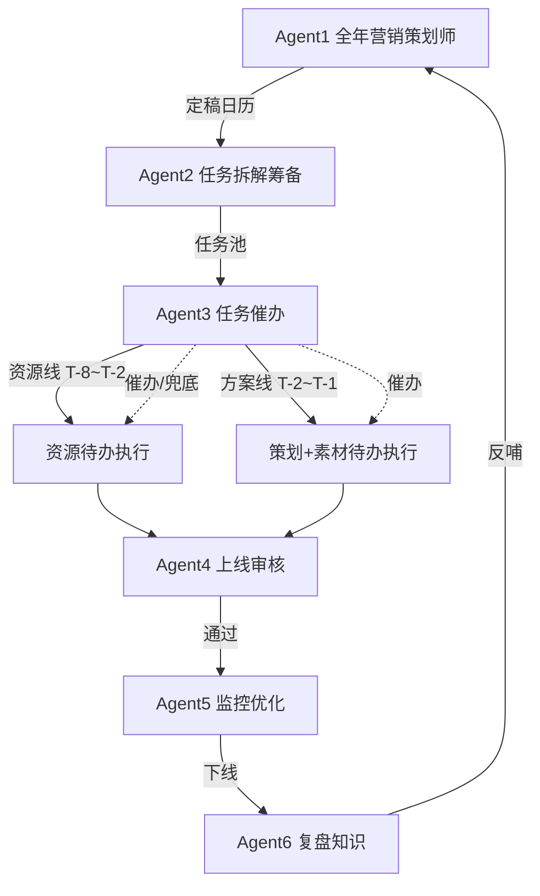

# 多 Agent 定义表 v6（来自业务方独立截图 · 确认稿）

> **版本**：v6.0 · 2026-08-18  
> **来源**：Agent1~6 独立截图 + SOP 全文  
> **说明**：本稿以**最新截图**为准；与此前「营销日历/竞品/资源/素材」六分法有结构调整，见 §八对照

---

## 总览：6 Agent 一览

| # | Agent 名称 | 一句话定位 | 主要阶段 |
| --- | --- | --- | --- |
| **1** | 全年营销活动策划师 | 人工规划 + AI 创意池 → 负责人逐项评审 → 定稿日历 | 阶段 1、2 |
| **2** | 活动任务拆解筹备 | 建档 + 按一级维度生成任务池（资源/策划/素材） | 阶段 3~5 筹备 |
| **3** | 活动任务催办 | 贯穿全流程调度：依赖、催办、延期预测、资源缺口兜底 | 阶段 2 起至活动结束 |
| **4** | 上线审核 | T-1 质量门：10 项 + 五维 AI 审核 + 风险分级 | 阶段 5 |
| **5** | 在线监控与优化 | 实时运营参谋：看板 + 异常诊断 + 优化建议 + 自动上下线 | 阶段 6 |
| **6** | 复盘与知识沉淀 | 经验萃取：三步复盘 + 四库 + 知识反哺日历 | 阶段 7 |

---

## Agent 1 · 全年营销活动策划师

| 维度 | 内容 |
| --- | --- |
| **主要定位** | 线下人工规划全年活动 + AI 自动采集信息补充创意；负责人逐项评审后输出最终全年营销日历 |
| **对应阶段** | **阶段一**：年度营销日历收集与补充 · **阶段二**：评审定稿、跨部门对齐 |
| **主要工作** | ① 建立年度营销互动规划**评审池** ② 两来源：来源1人工规划 / 来源2 AI 信息采集任务形成的**互动创意池** ③ 营销负责人组织评估，通过项进入最终全年日历 |
| **输入** | ① 年度日历草案 ② AI 创意池（来自 AI 信息采集 Prompt 任务） |
| **输出** | 增/并/提前/延后建议 · 主题/目的地缺失报告 · 时间冲突预警 · Leading Date 计算结果 · **《年度营销日历定稿》** |
| **待办确认** | ① 营销日历**表头格式**（评审所需字段）② 与业务共建 AI 创意信息采集 **Skill**（采哪些维度、输出格式） |

**系统映射**：现 Agent1 方案库 + 行业情报 → 合并增强为本 Agent；竞品/行业信息作为 Agent1 的输入源之一（见 §八）。

---

## Agent 2 · 活动任务拆解筹备

| 维度 | 内容 |
| --- | --- |
| **主要定位** | 活动**项目拆解**：定稿活动 → 可执行任务 |
| **对应阶段** | 营销活动建档 · 待办梳理/催办/验收 · 资源准备待办 · 落地方案 · 上线素材 |
| **主要工作** | ① 按二级表（日历基本信息+筹备信息）**逐活动建档** ② 生成**活动任务池**：基本信息 + 全部待办，分三个**一级维度**：**资源待办** / **活动策划待办** / **营销素材待办**（每项含：名称、内容、交付时间、交付物、负责人、验收状态） |
| **输入** | ① 活动文档 ② 一级任务下的二级子任务分析（可人工录入）③ 任务详情、验收标准、执行人、验收人、交付时间、提醒时间 |
| **输出** | 自动催办触发条件 · 结构化任务内容 |
| **待办确认** | ① 资源方内外部流程与各活动时间周期 ② **标准化活动方案**格式（背景/方案/玩法/时间/位置等；除资源外待办均由此拆出）③ 单活动需验收的**维度总数**（求各活动一致、时间可不同） |

**系统映射**：新建核心能力；`dim_campaign` + `fact_activity_todos` 三维度模板。

---

## Agent 3 · 活动任务催办

| 维度 | 内容 |
| --- | --- |
| **主要定位** | **贯穿全流程**的调度中枢 |
| **对应阶段** | **阶段二**立项主档 · T-8 至活动结束 |
| **主要工作** | ① **自动建任务**：双线模板（资源线+方案线），设负责人与截止时间 · 资源线 T-8→T-4→T-2 · 方案线 T-2→T-1 ② **依赖管理**：任务依赖、关键路径、前置任务状态 ③ **自动催办**：到期催办、临期预警 ④ **延期预测**：结合进度/历史耗时/负责人负荷 · 不影响关键路径→提醒+可分批 · 影响关键路径→方案（复用素材/调时间）需审批 ⑤ **资源缺口兜底**：未达标→Top100 热销∩高请求+UV 补齐逻辑 |
| **输入** | 活动主档 · 任务依赖 · 负责人负荷 · 前置任务状态 · 历史任务耗时 |
| **输出** | 任务清单 · 催办提醒 · 延期预测 · 延期方案 · 资源缺口预警 |
| **待办确认** | ① 双线筹备**模板**定义 ② 任务**依赖规则** ③ 催办**触发条件** ④ **关键路径**判定逻辑 ⑤ 负责人**负荷**计算规则 ⑥ 兜底酒店**筛选规则** |

**系统映射**：增强 `orchestrator.py` + 独立 Agent3 UI/API；与 Agent2「拆解」分工：**2 生成任务结构，3 驱动运行与催办**。

---

## Agent 4 · 上线审核

| 维度 | 内容 |
| --- | --- |
| **主要定位** | 上线质量把关 · **上线前一周终审** |
| **对应阶段** | **阶段五** 上线准备与联合验收 |
| **主要工作** | ① **完整性**（10 项确认）② **跨材料一致性**（资源↔券、素材↔位置、时间↔主档）③ **实际运行验证**（券可领用、页面跳转）④ **GP 与预算** ⑤ **埋点验证** ⑥ **风险分级**：低→允许 / 中→审批 / 高→拒绝退回 |
| **输入** | 资源清单 · 券配置 · 素材终稿 · 上下线时间 · 埋点配置 · 酒店清单 · 客户群清单 |
| **输出** | 就绪结论 · 阻断/风险/提醒清单 · 风险分级报告 · 上线审批建议 |
| **待办确认** | ① 10 项清单细则 ② 一致性校验规则 ③ GP 阈值（高亏/中亏/高赚）④ 埋点系统对接 ⑤ 风险分级标准 ⑥ 审批流 |

**系统映射**：新建 Agent4；SOP 阶段 5 完整覆盖。

---

## Agent 5 · 在线监控与优化

| 维度 | 内容 |
| --- | --- |
| **主要定位** | **实时运营参谋** |
| **对应阶段** | **阶段六** 正式上线与实时监控 |
| **主要工作** | ① 日采核心指标（曝光/点击/CTR/CVR/GMV/GP/ROI/取消率）+ 营销位维度 ② 看板四块规则 ③ **异常诊断**（曝光/CTR/CVR/GP 四象限）④ 优化建议（调位/换素材/调价/暂停高亏项）⑤ **按设定时间自动上下线** |
| **输入** | 日监控数据 · 营销位配置 |
| **输出** | 日数据看板 · 异常诊断报告 · 优化建议 · 上下线执行日志 |
| **待办确认** | ① 监控数据源对接 ② 异常信号阈值 ③ 诊断规则库 ④ 可执行优化动作清单 ⑤ 看板呈现规则 ⑥ 自动上下线机制对接 |

**Hold point**：预算/价格变更须人工审批（SOP）。

**系统映射**：现 Agent3 监控增强。

---

## Agent 6 · 复盘与知识沉淀

| 维度 | 内容 |
| --- | --- |
| **主要定位** | **经验萃取专家** |
| **对应阶段** | **阶段七** 复盘总结与归档入库 |
| **主要工作** | ① 数据质量审核 ② 真实增量四维度对比 ③ 贡献六维拆解 ④ 高表现→知识卡 / 低表现→避坑规则 ⑤ **四库归档** ⑥ 高表现目的地/酒店反哺日历候选池 |
| **输入** | 活动数据 · 对照组 · 历史基线 · 去年同期 · 预设目标 · 埋点数据 |
| **输出** | 复盘报告 · 知识卡 · 避坑规则 · 四库记录 · 高表现候选池更新 |
| **待办确认** | ① 数据质量审核规则 ② 对照组选取规则 ③ 六维拆解口径 ④ 四库归档机制 ⑤ 知识卡模板 ⑥ 知识反哺机制 |

**系统映射**：合并现 Agent4 分析 + Agent5 归档。

---

## 协作流程图（v6）



---

## 与现代码迁移表

| v6 Agent | 代码现状 | 动作 |
| --- | --- | --- |
| Agent1 | `agent1_planner` + `intel_service` | 增强：评审池双来源、Leading Date、定稿闸门 |
| Agent2 | 无 | **新建**：建档 + 三维度任务池模板 |
| Agent3 | `orchestrator` 雏形 | **新建 Agent 壳**：催办/依赖/延期/兜底 |
| Agent4 | 无 | **新建**：10 项 + 五维审核 + 风险分级 |
| Agent5 | `agent3_monitor` | 增强：诊断规则 + 自动上下线 |
| Agent6 | `agent4` + `agent5` | **合并** |

---

## §八 与此前两版方案对照（避免混淆）

| 能力 | 截图 v6 | 上一版表格（日历/竞品/资源/素材/上线/复盘） | 建议 |
| --- | --- | --- | --- |
| 日历+AI创意 | **Agent1** | Agent1 日历 | ✅ 一致 |
| 竞品/行业监控 | 合入 **Agent1 输入** + 情报任务 | 独立 Agent2 | ⚠️ 不单独 Agent，但保留**行业情报模块**作 Agent1 输入 |
| 资源准备 | **Agent2 资源待办** + Agent3 兜底 | 独立 Agent3 | ✅ 按截图：任务化，非独立 Agent |
| 素材/策划 | **Agent2 待办维度** | 独立 Agent4 | ✅ 按截图 |
| 任务催办/PM | **Agent3 独立** | 编排中枢 | ✅ 截图明确为 Agent3 |
| 上线审核 | **Agent4** | Agent5 | ✅ 一致 |
| 监控 | **Agent5** | Agent6 一部分 | ✅ |
| 复盘四库 | **Agent6** | Agent6 一部分 | ✅ |

**最终采用：以本 v6 截图定义为准。**

---

## 确认后开发顺序

```
Phase A  壳层：6 Agent 导航 + config/agents.yaml 重命名 + 路由前缀
Phase B  Agent1 评审池双来源 + 表头字段占位
Phase C  Agent2 建档 + 三维度任务池 CRUD
Phase D  Agent3 催办/依赖/T-N 里程碑（接 Rachel 规则后补兜底）
Phase E  Agent4 上线审核 Checklist
Phase F  Agent5/6 增强现有监控与复盘
```

---

> **待你确认**：Agent2（拆解）与 Agent3（催办）分工 · 竞品监控不独立 Agent · 共 6 Agent 按本表开发
