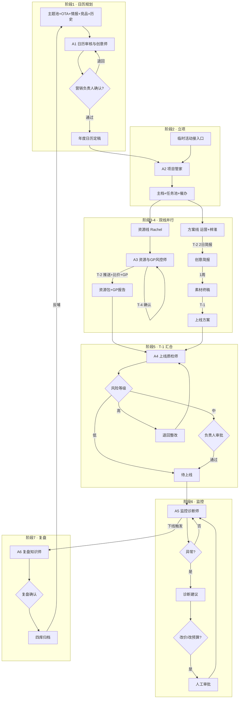

# 多 Agent 营销协作系统 — Agent 方案 v4（对齐 SOP）

> **版本**：v4.0 · 2026-08-18  
> **依据**：《营销活动全流程管理 SOP》全文 + 流程图截图  
> **原则**：方案确认后再改代码；SOP 定义 **6 个 AI Agent**，与线下 7 阶段一一映射  
> **当前系统**：5 Agent（策划/资源/监控/分析/归档）— 见文末差距对照

---

## 一、SOP 核心理解（线下人工流程摘要）

### 1.1 三条原则

| 原则 | 含义 |
| --- | --- |
| 业务优先 | 自动化逻辑必须来自人工判断规则 |
| 人机协同 | AI 做采集/催办/统计；方案评审、资源确认、预算改价必须人工 |
| 先贯通后迭代 | Phase 1 优先日历+竞品监控，不等 100% 对齐 |

### 1.2 七阶段 + 双线并行

```
阶段1  年度营销日历规划
  ↓
阶段2  活动立项 · 主档建立（T-8 自动立项；临时活动接入口）
  ↓
  ├─ 阶段3  资源准备线（Rachel）T-8 → T-4 → T-2
  └─ 阶段4  营销方案线（运营）T-2 简报 → 素材 → T-1 方案
  ↓（T-1 汇合）
阶段5  上线准备 · 联合验收（10 项 + AI 上线审核 + 风险分级）
  ↓
阶段6  正式上线 · 实时监控（异常诊断；改价/改预算需审批）
  ↓
阶段7  复盘 · 四库归档 · 知识反哺 → 回到阶段1
```

**关键节奏**：资源线**先启动**；T-2 资源推送运营并触发方案线；T-1 两线汇合验收。

---

## 二、建议 Agent 架构：**6 Agent**（与 SOP §3.1 一致）

| # | Agent 名称 | 英文标识 | 负责阶段 | 一句话定位 |
| --- | --- | --- | --- | --- |
| **A1** | **日历审核与创意师** | `calendar_agent` | 阶段 1 | 六维度输入 + AI 查缺失/冲突/Leading Date + 补创意 |
| **A2** | **项目管家** | `pm_agent` | 阶段 2 | 立项建主档 + 双线任务拆解 + 催办 + 关键路径延期预测 |
| **A3** | **资源与 GP 风控师** | `resource_agent` | 阶段 3 | 资源匹配 T-8/T-4 + 比价验价 + GP 风险分级 + 兜底逻辑 |
| **A4** | **上线质检师** | `launch_qa_agent` | 阶段 5 | 10 项确认 + AI 五维审核 + 低/中/高风险分流 |
| **A5** | **监控诊断师** | `monitor_agent` | 阶段 6 | 自动上下线 + 看板 + 异常诊断 + 调优建议（改价需审批） |
| **A6** | **复盘知识师** | `review_agent` | 阶段 7 | 复盘三步 + 四库归档 + 知识卡/避坑规则 + 反哺日历 |

> **阶段 4（方案线）不设独立 AI Agent**：创意简报、梓淮素材、运营审核为**人工任务**，由 **A2 项目管家** 管理待办与 SLA（T-2 简报 2 日、素材 1 周、T-1 审核）。

---

## 三、各 Agent 详细定义

### A1 · 日历审核与创意师

| 项 | 内容 |
| --- | --- |
| **工作定位** | 年度/基线营销日历的 AI 审核与创意补充，不做圈客不做上线 |
| **主要能力** | ① 聚合主题池+OTA+情报+竞品+历史日历 ② 查缺失/查冲突/算 Leading Date P75 ③ 补创意与预算 CP 建议 ④ 退回修订循环 |
| **主要输出** | 《年度营销日历（定稿）》· 每活动含主题/目的地/上下线/手段/目标/预算/负责人 |
| **人工关口** | **营销负责人**逐项确认或退回 |
| **协作输出** | 跨部门同步清单（资源/素材/技术/数据配合时间点） |

### A2 · 项目管家

| 项 | 内容 |
| --- | --- |
| **工作定位** | 活动立项后的**任务编排中枢**，不管资源细节不管监控 |
| **主要能力** | ① T-8 自动立项 + `activity_id` ② 双线任务模板（资源线+方案线）③ 依赖/截止时间/负责人 ④ 到期催办 ⑤ 关键路径延期预测与方案建议 |
| **主要输出** | 活动主档 + 全量任务池 + 催办记录 + 延期预警 |
| **人工关口** | 影响关键路径的延期方案需**负责人审批** |
| **标准方案** | 校验 11 模块最小信息集是否齐全，缺失则阻塞推进 |

### A3 · 资源与 GP 风控师

| 项 | 内容 |
| --- | --- |
| **工作定位** | Rachel 资源线的系统化身：清单→确认→推送→比价→GP |
| **主要能力** | ① T-8 按画像匹配酒店 ② T-4 数量达标判据 + 缺口兜底（Top100 热销∩高请求+UV 补齐）③ T-2 推送运营 ④ 比价验价 + 手段选择 ⑤ GP 风险分级 |
| **主要输出** | 确认版资源清单 + 营销手段 + GP 风险报告 |
| **人工关口** | 资源确认；**高亏/中亏**需业务负责人/财务审批 |
| **Hold point** | 高赚自动通过；高亏阻断直到审批 |

### A4 · 上线质检师

| 项 | 内容 |
| --- | --- |
| **工作定位** | T-1 两线汇合后的**上线前最后一道 AI+人工门** |
| **主要能力** | ① 10 项确认完整性 ② 跨材料一致性 ③ 券/页实测 ④ GP 与预算 ⑤ 埋点验证 ⑥ 风险低/中/高分级 |
| **主要输出** | 上线就绪结论 + 风险报告 + 待整改清单 |
| **人工关口** | 中风险→负责人审批；高风险→退回整改重审 |
| **终态** | 待上线（scheduled） |

### A5 · 监控诊断师

| 项 | 内容 |
| --- | --- |
| **工作定位** | 上线后只看数据、给诊断，**不自动改价改预算** |
| **主要能力** | ① 按上下线时间自动执行 ② 日采曝光/点击/CTR/CVR/GMV/GP/ROI/取消率 ③ 看板规则 ④ 异常→诊断→调优建议 |
| **主要输出** | 实时看板 + 异常诊断报告 + 调优动作建议（待审批） |
| **人工关口** | **预算/价格变更**必须业务负责人/财务审批 |
| **诊断矩阵** | 曝光低→流量；CTR 低→素材；CVR 低→价格；GP 低→定位高亏项 |

### A6 · 复盘知识师

| 项 | 内容 |
| --- | --- |
| **工作定位** | 下线后自动复盘 + 四库 + 闭环反哺日历 |
| **主要能力** | ① 数据质量审核 ② 真实增量（对照组/基线/同比/目标）③ 六维贡献拆解 ④ 知识卡/避坑规则 ⑤ 四库写入 ⑥ 高表现目的地/酒店反哺候选池 |
| **主要输出** | 复盘报告 + 四库记录 + 知识反哺清单 |
| **人工关口** | 复盘结论确认；数据不可信时人工核实 |
| **四库** | 案例库 / 客户画像库 / 高产酒店库 / 活动标签 |

---

## 四、6 Agent 协作总流程图



---

## 五、SOP 七阶段 ↔ 6 Agent 对照表

| 阶段 | 主线输出 | 负责 Agent | 人工关口 |
| --- | --- | --- | --- |
| **1** 日历规划 | 年度日历定稿 | **A1** | 营销负责人 |
| **2** 立项建档 | 主档+任务池 | **A2** | 关键路径延期方案 |
| **3** 资源线 | 资源包+GP 报告 | **A3** | Rachel 确认；高/中亏审批 |
| **4** 方案线 | 简报+素材+上线方案 | **A2** 管任务 | 梓淮制作；运营审核 |
| **5** T-1 验收 | 上线就绪 | **A4** | 中/高风险审批 |
| **6** 监控 | 看板+诊断 | **A5** | 改价/改预算审批 |
| **7** 复盘归档 | 报告+四库 | **A6** | 复盘结论确认 |

---

## 六、与现有 5-Agent 系统差距（为何需调整）

| 现有 Agent | 现定位 | SOP 要求 | 结论 |
| --- | --- | --- | --- |
| Agent1 方案策划师 | 飞书日历+方案库 | **A1 日历 AI 审核** + Leading Date + 冲突检测 | 🟡 需增强为 A1 |
| — | 无 | **A2 项目管家**（T-8 立项、双线任务、催办） | 🔴 **新增** |
| Agent2 资源配置师 | MCP 圈客+待办 | **A3** T-8/T-4/T-2 + GP 风险 + 兜底逻辑 | 🟡 大幅增强 |
| — | 无 | **A4 上线质检**（10 项+五维 AI 审核+风险分级） | 🔴 **新增** |
| Agent3 监控师 | 看板框架 | **A5** 自动上下线+诊断矩阵+改价闸门 | 🟡 增强 |
| Agent4 分析师 | 复盘报告 | 合并入 **A6** 三步复盘 | 🟡 合并增强 |
| Agent5 归档师 | 案例库 | **A6** 四库+知识反哺 | 🟡 扩展为四库 |

**建议迁移路径**（确认后实施）：

```
现 Agent1  →  拆为 A1（日历）+ 保留方案 Schema 供 A2 校验
新增       →  A2 项目管家
现 Agent2  →  升级为 A3 资源与 GP 风控
新增       →  A4 上线质检
现 Agent3  →  升级为 A5 监控诊断
现 Agent4+5 → 合并升级为 A6 复盘知识
阶段4      →  无新 Agent，A2 任务池承载
```

---

## 七、各阶段待确认问题清单（落地前必须对齐）

### 阶段 1 · 日历规划（侯老师）

- [ ] Leading Date P75 的数据源表/SQL 口径？按目的地还是全球统一？
- [ ] 「五天半内过于密集」的冲突规则精确定义？
- [ ] 「资源团队负荷失衡」如何量化？
- [ ] 2026 基线日历导入字段是否与 §11.1 表头完全一致？
- [ ] 营销负责人「确认留痕」在飞书还是系统内？

### 阶段 2 · 立项（A2）

- [ ] T-8 相对「上线日」还是「Leading Date 建议上线日」？
- [ ] 双线任务模板：资源线/方案线各有哪些固定任务节点？
- [ ] 临时活动接入口：谁有权限创建？需哪些审批字段？
- [ ] 11 模块方案：哪些模块在 T-8 必填 vs 可后补？

### 阶段 3 · 资源线（Rachel）

- [ ] 「近 30 天热销榜/高请求榜 Top100」的 MCP 表与字段？
- [ ] GP 高亏/中亏/高赚的阈值公式？谁维护？
- [ ] 资源数量目标：按活动预设还是按目的地规则表？

### 阶段 4 · 方案线（运营+梓淮）

- [ ] 创意简报是否有标准模板/字段？
- [ ] 素材模块是否纳入统一系统？还是仅 A2 任务跟踪？
- [ ] 各营销位尺寸规格清单由谁维护？

### 阶段 5 · 上线验收

- [ ] 10 项确认：每项验收标准与责任人？
- [ ] AI 上线审核：券/页面实测环境（预发/生产）？
- [ ] 中风险「GP 接近阈值」的具体数值？

### 阶段 6 · 监控（曼薇）

- [ ] 看板四块规则的数据刷新频率？
- [ ] 异常阈值（CTR/CVR/GP 亏损线）默认值？
- [ ] 自动上下线对接 portal 后台 API 是否已有？

### 阶段 7 · 复盘

- [ ] 对照组如何选取（未参加活动客户）？
- [ ] 四库写入字段与检索标签体系？
- [ ] 知识反哺进日历候选池的自动规则？

---

## 八、一眼判断：现系统是否满足 SOP？

| 维度 | 满足？ | 说明 |
| --- | --- | --- |
| 七阶段主线 | 🟡 部分 | 有方案→资源→监控→复盘骨架，缺日历 AI 审核、双线并行、T-N 里程碑 |
| 6 AI Agent 分工 | 🔴 不满足 | 缺 A2 项目管家、A4 上线质检；A1/A3/A5/A6 能力偏薄 |
| 双线 T-8/T-4/T-2/T-1 | 🔴 不满足 | 无并行状态机与里程碑催办 |
| GP 风险闸门 | 🔴 不满足 | 无 |
| 10 项+AI 五维审核 | 🔴 不满足 | 无 |
| 四库+知识反哺 | 🟡 部分 | 仅有案例库框架 |
| 人机协同原则 | ✅ 满足 | 闸门理念一致，需补财务/负责人审批节点 |
| Phase 1 优先日历+竞品 | 🟡 可启动 | 行业情报框架有，日历 AI 审核无 |

**结论**：现有 5-Agent 是**正确方向的原型**，与 SOP 对齐需 **5→6 Agent 重构**（增 A2/A4，增强 A1/A3/A5，合并 A6），**确认本方案后再改代码**。

---

> **下一步**：业务方确认 §二 Agent 划分 → 各 Owner 填 §七确认项 → 研发按 Phase 1（A1 日历 + 竞品监控）排期
