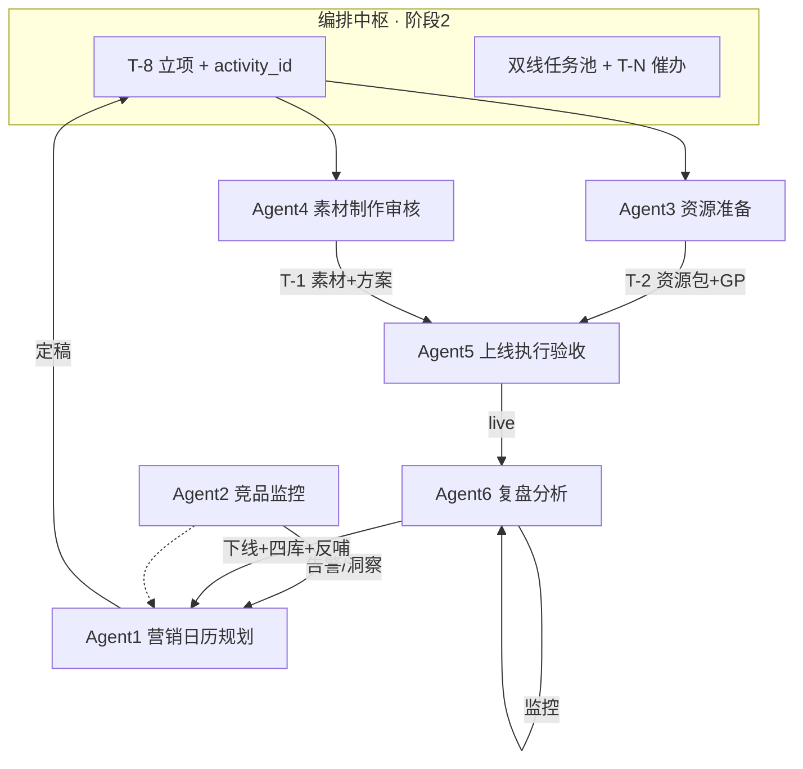

# 多 Agent 营销协作系统 — 最终方案框架 v5（确认稿）

> **版本**：v5.0 · 2026-08-18  
> **依据**：用户新规划 6 Agent 表 + 《营销活动全流程管理 SOP》+ 现有代码  
> **状态**：**待确认后开发** — 确认本稿即开始调整系统

---

## 一、最终 Agent 架构（采用你新规划的 6 Agent）

| # | Agent 名称 | 标识 | 业务定位 | SOP 阶段 |
| --- | --- | --- | --- | --- |
| **1** | **营销日历规划 Agent** | `calendar` | 大脑：年度/周期战略规划 | 阶段 1 |
| **2** | **竞品/行业活动监控 Agent** | `intel_monitor` | 眼睛：外部情报与竞品告警 | 贯穿 1，重点 P1 |
| **3** | **资源准备 Agent** | `resource` | 供应链：酒店资源与 GP | 阶段 3 |
| **4** | **素材制作及内容审核 Agent** | `creative` | 创意与质量门 | 阶段 4 |
| **5** | **上线执行及验收 Agent** | `launch` | 执行引擎与上线前质检 | 阶段 5 |
| **6** | **复盘分析 Agent** | `review` | 数据分析师与学习闭环 | 阶段 6 + 7 |

> **补充（非第 7 Agent）**：**编排中枢 `orchestrator`** — 承载 SOP 阶段 2（T-8 立项、主档、双线任务池、T-N 催办、延期预测）。各 Agent 专注领域能力，**流程编排由中枢统一调度**。

---

## 二、各 Agent 定义（合并你的规划 + SOP 细节）

### Agent 1 · 营销日历规划

| 维度 | 内容 |
| --- | --- |
| **定位** | 活动策划系统的大脑 |
| **核心逻辑** | 外部趋势（OTA、竞品摘要）+ 内部数据（离店、Leading Date P75）→ 生成并审核日历 |
| **关键节点** | 输入收集 → 自动生成初版 → AI 审核（缺失/冲突/Leading Date）→ 补目标/预算/手段建议 |
| **输出** | 《营销日历定稿》：主题、目的地、上下线、手段、目标、预算 |
| **人工关口** | 营销负责人确认 / 退回 |
| **备注** | 接收 Agent 2 竞品告警反哺调整日历 |

### Agent 2 · 竞品/行业活动监控

| 维度 | 内容 |
| --- | --- |
| **定位** | 系统的眼睛，实时外部告警 |
| **核心逻辑** | 监控 OTA/竞品 → 识别机会与威胁 → 告警 → 反哺 Agent 1 |
| **关键节点** | 竞品跟踪 → 趋势分析 → 实时告警 → 分区域/分场景解读 |
| **输出** | 监控报告、告警通知、市场洞察摘要 |
| **人工关口** | 告警响应（是否调整日历/是否立项临时活动） |
| **备注** | **Phase 1 高优**；对应现有「行业情报中心」升级独立 Agent |

### Agent 3 · 资源准备

| 维度 | 内容 |
| --- | --- |
| **定位** | 供应链协调，酒店库存与价格 |
| **核心逻辑** | 日历目的地需求 ↔ 可售资源 ↔ 比价/GP |
| **关键节点** | T-8 匹配清单 → T-4 Rachel 确认 → 缺口兜底（Top100 热销∩请求+UV）→ T-2 推送运营 + 比价 + GP 分级 |
| **输出** | 确认版资源清单、价格/毛利分析报告 |
| **人工关口** | Rachel 资源确认；高亏/中亏财务或负责人审批 |
| **备注** | 兜底机制防资源短缺拖垮活动 |

### Agent 4 · 素材制作及内容审核

| 维度 | 内容 |
| --- | --- |
| **定位** | 创意与质量门 |
| **核心逻辑** | 主题 → 创意需求 → AI 审核合规/品牌/事实 |
| **关键节点** | 自动生成创意简报（T-2 后 2 日 SLA）→ 辅助文案/视觉 → AI 内容审核 → 退回梓淮修改意见 |
| **输出** | 标准创意简报、审核通过的素材（Banner/文案等） |
| **人工关口** | 梓淮制作；活动运营终审 |
| **备注** | AI 审不等于替代设计，是质量预检 |

### Agent 5 · 上线执行及验收

| 维度 | 内容 |
| --- | --- |
| **定位** | 执行引擎与上线前 inspector |
| **核心逻辑** | 技术配置 + 多维验收 + 风险阻断 |
| **关键节点** | 系统配置（券/位/规则）→ 10 项 Checklist → 销售预热宣导 → AI 五维审核 → 低/中/高风险分流 |
| **输出** | 活动 live 状态、内部预热 memo、验收报告 |
| **人工关口** | 中风险负责人批；高风险退回 |
| **备注** | 合并 SOP「销售端预热宣导」固定环节 |

### Agent 6 · 复盘分析

| 维度 | 内容 |
| --- | --- |
| **定位** | 数据分析师 + 学习闭环 |
| **核心逻辑** | 实时监控 + 事后复盘 + 知识归档 → 反哺 Agent 1 |
| **关键节点** | **在线**：曝光/CTR/CVR/GMV/GP/ROI/取消率 + 异常诊断 + 调优建议（改价需批） **下线后**：数据质量 → 真实增量 → 贡献拆解 → 四库 → 知识卡/避坑 |
| **输出** | 实时看板、复盘报告、四库记录、优化知识库 |
| **人工关口** | 改价/改预算审批；复盘结论确认 |
| **备注** | 合并原 Agent3 监控 + Agent4 分析 + Agent5 归档 |

---

## 三、协作总流程图（最终版）



**双线并行（SOP 要求）**：
- 资源线：Agent 3（T-8 → T-4 → T-2）
- 方案线：Agent 4（T-2 简报 → 素材 → T-1）
- T-1 汇合：Agent 5

---

## 四、三方对比：你的新规划 vs 旧 V4 vs 现有代码

| 维度 | 你新规划 6 Agent | 旧 V4 方案 | 现有 5 Agent 代码 |
| --- | --- | --- | --- |
| 日历规划 | ✅ Agent 1 独立 | ✅ A1 | 🟡 Agent1 部分 |
| 竞品监控 | ✅ **Agent 2 独立** | 🟡 合在 A1/情报 | 🟡 行业情报页 |
| 项目管家 | 🟡 **无独立 Agent** | ✅ A2 独立 | ❌ 无 |
| 资源准备 | ✅ Agent 3 | ✅ A3 | 🟡 Agent2 |
| 素材审核 | ✅ **Agent 4 独立** | ❌ 人工 only | ❌ 无 |
| 上线验收 | ✅ Agent 5 | ✅ A4 | 🟡 Agent2 待办 |
| 监控+复盘 | ✅ **Agent 6 合并** | 分开 A5+A6 | Agent3+4+5 三个 |
| Agent 数量 | **6** | 6 | 5 |

### 结论：采用你的新规划，仅补一项

| 调整建议 | 说明 |
| --- | --- |
| ✅ **采用你的 6 Agent 命名与分工** | 比 V4 更贴合 Phase 1（日历+竞品分列）、素材独立 Agent |
| ➕ **增加编排中枢（非 Agent）** | 补上 SOP 阶段 2：T-8 立项、任务池、催办、延期预测 — V4 的 A2 能力不降权，改为平台层 |
| ✅ **Agent 6 合并监控+复盘** | 与你在表中「实时+事后」一致；代码内分 `monitor` / `review` 两个子模块即可 |
| ✅ **Agent 2 与 Agent 1 解耦** | 竞品监控 P1 高优，独立迭代 |

---

## 五、现有代码 → 新 6 Agent 迁移映射

| 新 Agent | 迁移来源 | 主要改动 |
| --- | --- | --- |
| **Agent1 日历规划** | `agent1_planner.py` 日历/方案库/采纳 | + Leading Date、AI 审核、六维度面板 |
| **Agent2 竞品监控** | `intel_service.py` + `intel_tasks.yaml` | 独立 Agent 路由/UI；告警反哺 A1 |
| **Agent3 资源准备** | `agent2_resource.py` | + T-8/T-4/T-2、GP 分级、兜底逻辑 |
| **Agent4 素材审核** | **新建** | 简报生成、AI 内容审核、梓淮任务流 |
| **Agent5 上线验收** | `agent2` 待办 + **新建** Checklist | 10 项 + AI 五维审核 + 销售预热 |
| **Agent6 复盘分析** | `agent3` + `agent4` + `agent5` | 合并；子模块 monitor / review / archive |
| **编排中枢** | `orchestrator.py` 增强 | T-8 立项、双线任务、催办、里程碑 |

**UI 导航建议**（6 + 配置）：
```
Agent1 营销日历规划
Agent2 竞品行业监控
Agent3 资源准备
Agent4 素材制作审核
Agent5 上线执行验收
Agent6 复盘分析
────────────
系统配置 / 编排看板（活动主档+任务池）
```

---

## 六、SOP 七阶段 ↔ 最终方案对照（一眼验收）

| SOP 阶段 | 负责 | 是否覆盖 |
| --- | --- | --- |
| 1 日历规划 | Agent 1 + Agent 2 输入 | ✅ |
| 2 立项主档 | **编排中枢** | ✅（非 Agent） |
| 3 资源线 | Agent 3 | ✅ |
| 4 方案线 | Agent 4 | ✅ |
| 5 T-1 验收 | Agent 5 | ✅ |
| 6 监控 | Agent 6 · monitor | ✅ |
| 7 复盘四库 | Agent 6 · review | ✅ |

---

## 七、确认清单（请你拍板）

- [ ] **6 Agent 划分**按本稿执行（不再用旧 5 Agent 命名）
- [ ] **编排中枢**作为平台能力，不算第 7 Agent
- [ ] **Agent 6** 合并监控+复盘+归档（内部两子模块）
- [ ] **Phase 1 先做**：Agent 1 + Agent 2 + 编排中枢基础
- [ ] **2025 Q4 活动**不迁移，服务 2026 筹备

**确认后开发顺序**：
```
Step1  重构路由/UI/config → 6 Agent 壳 + 编排看板
Step2  Agent1 日历 + Agent2 竞品（P1）
Step3  编排中枢 T-8 立项 + 任务池
Step4  Agent3~6 按 Rachel/曼薇/梓淮规则逐步增强
```

---

> **与旧 V4 唯一实质差异**：竞品独立为 Agent 2、素材独立为 Agent 4、监控复盘合并为 Agent 6；「项目管家」沉入编排中枢而非独立 Agent。
