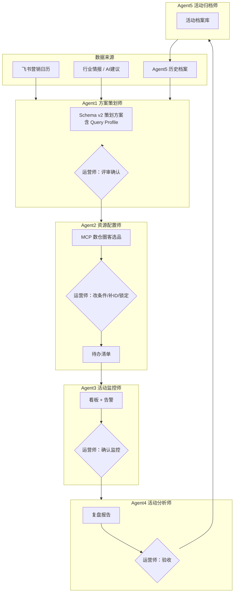

# 5-Agent 营销协作系统 — 业务逻辑评审 PRD

> **会议用途**：与运营师对齐线下真实活动策划流程，评审系统 Agent 分工、协同与人工闸门，识别差距并输出改造需求清单。  
> **评审方式**：按「全链路走一遍 → 分 Agent 深潜 → 场景对照 → 待办决议」进行。  
> **会后交付**：填写文末「决议记录表」，交研发排期改造。

---

## 1. 会议目标（5 分钟）

| 目标 | 说明 |
|------|------|
| 对齐认知 | 5 个 Agent 各自干什么、不干什么 |
| 验证流程 | 线下策划 → 上线 → 监控 → 复盘，系统是否覆盖 |
| 找差距 | 哪些步骤系统做不了 / 做得不对 / 运营师不愿用 |
| 定契约 | Agent 之间交接什么、格式是什么、谁确认 |
| 输出需求 | 会后形成优先级明确的改造 Backlog |

---

## 2. 系统一句话

**把飞书营销日历 + 数仓客户行为 + 行业情报，变成「可评审的活动方案 → 可执行的圈客选品 → 可监控的上线活动 → 可复用的历史档案」；每个关键节点由运营师确认，AI 不自动上线。**

---

## 3. 全链路协作逻辑（10 分钟）



### 3.1 状态机（活动在哪一步）

```
draft → plan_review → sent_to_agent2 → resource_config → todo_execution
  → testing → scheduled → live → monitoring → review → archived
```

### 3.2 人工闸门（必须运营师点确认）

| # | 闸门 | 位置 | 不确认则 |
|---|------|------|----------|
| G1 | AI 建议采纳/拒绝/合并 | Agent1 | 不入日历池 |
| G2 | 方案评审完成 | Agent1 | 不能送 Agent2 |
| G3 | 送 Agent2 | Agent1→2 | Agent2 不启动 |
| G4 | 资源配置锁定 | Agent2 | 不生成待办 / 不能提交测试 |
| G5 | 待办全部完成 + 提交测试 | Agent2 | 不进测试 |
| G6 | 监控配置确认 | Agent3 | 不进入正式监控 |
| G7 | 复盘报告验收 | Agent4 | 不归档 |
| G8 | 归档确认 | Agent5 | 不入案例库 |

---

## 4. 分 Agent 评审卡（核心，约 60 分钟）

> 每张卡：**定位 → 输入 → 输出 → 工作流 → 配置 → 已实现 / 部分 / 未做 → 评审问题**

---

### Agent1 · 方案策划师

| 项 | 内容 |
|----|------|
| **定位** | 全年活动策划中心：读日历、收情报、出方案，不做圈客选品 |
| **不负责** | 调 MCP、配 Banner、发券、监控、复盘 |

**输入**

| 来源 | 内容 | 系统功能 |
|------|------|----------|
| 飞书日历 | 全年目的地营销计划 | 同步/ Mock 日历 |
| 行业情报 | 报告、竞对页面、趋势 | 情报任务 + 上传 + LLM 建议 |
| 历史档案 | 往期活动经验 | Agent5 RAG 检索 |
| 运营师 | 编辑、合并、新建 | 评审侧栏 Schema v2 |

**输出**

| 产出 | 格式 | 下游谁用 |
|------|------|----------|
| 结构化策划方案 | `plan_structured_json`（11 模块） | 运营师评审、Agent2 |
| Query Profile | ⑥⑦ 内 `query_profile` | **Agent2 圈客选品契约** |
| AI 建议池 | 待审列表 | 运营师采纳后进日历 |

**工作流**

```
读日历 → 识别「提前3个月 urgent_prep」→ 刷新 AI 建议
→ 运营师「评审方案」（11 模块编辑）
→ 「确认评审完成」→ 「送 Agent2」
```

**所需配置**

- 飞书 App ID / Secret / 日历 Table ID
- LLM Key（情报汇总、AI 建议；可选）
- `config/agents.yaml` 中 Agent1 提示词
- 情报任务 `config/intel_tasks.yaml`

**实现状态**

| 功能 | 状态 |
|------|------|
| 飞书日历读取 | ✅ Mock；生产需配凭证 |
| 11 模块评审 UI | ✅ |
| 评审确认闸门 | ✅ |
| 行业情报中心 | ✅ 框架；URL 采集为占位 |
| AI 建议 LLM 生成 | ⚠️ 需配 LLM Key |
| Query Profile 编辑 | ✅ |
| 档案 RAG 写入方案 | ⚠️ 基础检索，展示待加强 |

**评审问题（请运营师回答）**

- [ ] Q1-1：你们现在策划一份活动，**真实步骤**是哪几步？系统缺哪步？
- [ ] Q1-2：提前 **3 个月** 启动准备是否合理？应该是 1/2/4 个月？
- [ ] Q1-3：AI 建议你们希望 **谁审、审什么、多久审一次**？
- [ ] Q1-4：方案 11 模块里，**哪些必填、哪些可删**？
- [ ] Q1-5：⑥⑦ Query Profile（分组 ID、时间窗、星级）运营师 **会不会填**？要不要下拉/模板？

---

### Agent2 · 客户资源配置师

| 项 | 内容 |
|----|------|
| **定位** | 把已确认方案变成 **client 清单 + hotel 清单 + 上线待办** |
| **不负责** | 改方案目标、改活动主题、自动上线 |

**输入（来自 Agent1，必须）**

| 字段 | 用途 |
|------|------|
| `query_profile.destination` | 目的地过滤 |
| `query_profile.client_group_ids` | 客户分组 |
| `query_profile.time_window_days` | 行为时间窗 |
| `query_profile.step_codes` | 漏斗行为定义 |
| `query_profile.star_min` / `hotel_limit` | 选品条件 |
| `product_delivery.delivery_type` | Banner / 发券 / 组合 |
| `objectives.target_metrics` | 监控指标待办 |

**输出**

| 产出 | 格式 |
|------|------|
| 圈客结果 | `target_client_ids` + 数量 + 选客理由 |
| 选品结果 | `hotel_list`（ID、星级、均价、比价） |
| 执行条件快照 | `query_profile_applied` |
| 待办清单 | Banner / 券 / 短信 / 埋点 / 监控 / 上线时间 |

**工作流**

```
读 Agent1 Query Profile
→ 「执行圈客选品」（MCP）
→ 运营师验收
   ├─ 改条件 → 「预览 MCP 查询」→ 再执行
   ├─ 仍不对 → 上传 client_id / hotel_id（追加或替换）
   └─ 满意 → 「确认锁定资源配置」→ 生成待办
→ 待办逐项完成 → 「提交测试」
```

**所需配置**

- 数仓 MCP Key + 三表名（events / users / funnel）
- MCP 不可用时回退本地 SQLite（演示用）

**实现状态**

| 功能 | 状态 |
|------|------|
| 读 Query Profile 调 MCP | ✅ |
| 改条件重查 | ✅ |
| 人工 ID 覆盖/追加 | ✅ |
| 确认锁定后才生成待办 | ✅ |
| 比价 / 优惠券建议 | ✅ 规则版 |
| 漏斗 step 细粒度 SQL 过滤 | ⚠️ 模板有，方案层刚接入 |
| 与飞书「活动清单」回写 | ❌ 未做 |

**评审问题**

- [ ] Q2-1：圈客时除了 **目的地+分组**，还要哪些条件？（行业、GMV、活跃度标签？）
- [ ] Q2-2：选品除了 **星级+点击热度**，还要看什么？（库存、协议价、BD 推荐名单？）
- [ ] Q2-3：待办清单 **是否完整**？还缺哪些任务（法务、BD、设计规格）？
- [ ] Q2-4：人工上传 ID 的场景 **多不多**？格式是 client_id 还是机构名？
- [ ] Q2-5：测试环节 **谁测、测什么、通过标准** 是什么？

---

### Agent3 · 活动监控师

| 项 | 内容 |
|----|------|
| **定位** | 上线后 **只看数据、发告警**，不改配置 |
| **不负责** | 改圈客、改选品、改 Banner |

**输入**

- Agent2 待办中的 `monitor_metric`
- Agent1 的 `target_metrics`
- 数仓漏斗 / 埋点实时数据

**输出**

- 监控看板预览（Banner CTR → RP → 订单/TTV）
- 告警规则与触发记录

**工作流**

```
活动 live → 预览看板 → 运营师确认监控生效 → 定时告警
```

**所需配置**

- MCP 或本地 funnel/events 数据
- 告警阈值（待定义）

**实现状态**

| 功能 | 状态 |
|------|------|
| 看板预览 API | ⚠️ 基础 JSON 预览 |
| 告警规则配置 UI | ❌ |
| 钉钉/飞书告警推送 | ❌ |
| 与 Agent2 埋点 slide_id 联动 | ⚠️ 待办有字段，未深绑 |

**评审问题**

- [ ] Q3-1：活动上线后 **第一天/第一周** 盯哪些指标？
- [ ] Q3-2：什么情况下 **必须告警**？通知谁、什么渠道？
- [ ] Q3-3：监控发现问题， **谁决策** 调方案还是调资源？

---

### Agent4 · 活动分析师

| 项 | 内容 |
|----|------|
| **定位** | 活动结束后 **复盘 + 写回飞书** |
| **不负责** | 活动中改配置 |

**输入**

- Agent1~3 全链快照
- 数仓实际订单、TTV、GP、漏斗

**输出**

- 复盘报告（目标 vs 实际、漏斗、ROI、问题建议）
- 飞书「活动信息汇总」复盘字段回写

**工作流**

```
活动结束 → 生成报告 → 运营师验收 → 送 Agent5
```

**实现状态**

| 功能 | 状态 |
|------|------|
| 报告生成（规则+快照） | ⚠️ 基础 |
| PRD 八章完整结构 | ⚠️ 部分 |
| 飞书复盘回写 | ❌ |
| LLM 润色报告 | ❌ |

**评审问题**

- [ ] Q4-1：复盘报告 **必须包含哪些章节**？有无公司模板？
- [ ] Q4-2：复盘 **谁写、谁审**？周期是活动结束后几天？
- [ ] Q4-3：哪些结论 **必须回写飞书** 哪些字段？

---

### Agent5 · 活动归档师

| 项 | 内容 |
|----|------|
| **定位** | 完结活动 **结构化入库**，供 Agent1 下次参考 |
| **不负责** | 修改历史数据、自动创建新活动 |

**输入**

- Agent4 复盘报告 + 全链快照

**输出**

- `dim_activity_archive`：可复用经验 / 避坑点 / 成功标签

**工作流**

```
复盘验收 → 归档确认 → 案例库可检索
```

**实现状态**

| 功能 | 状态 |
|------|------|
| 归档 API | ✅ 基础 |
| 案例库 UI | ⚠️ 简单列表 |
| Agent1 检索引用展示 | ⚠️ 基础 |

**评审问题**

- [ ] Q5-1：档案里 **最想检索什么**？（目的地、活动类型、ROI 区间？）
- [ ] Q5-2：谁有权限 **标记**「成功案例 / 失败案例」？

---

## 5. Agent 协同契约（Agent1→2 重点，10 分钟）

**最稳定方案（已定稿）**

- Agent1 输出 **结构化 Query Profile**（不是纯自然语言）
- 自然语言（behaviors、圈选理由）只给人看
- Agent2 只执行 Query Profile，不猜语义
- 人工兜底：改条件重查 → 上传 ID → 确认锁定

**Agent1 送 Agent2 前 Checklist**

| ⑥ 客户 | ⑦ 酒店 | 全局 |
|--------|--------|------|
| ☐ destination | ☐ destination | ☐ delivery_type |
| ☐ time_window_days | ☐ star_min | ☐ target_metrics |
| ☐ client_group_ids | ☐ hotel_limit | ☐ 推广月份/上线时间 |
| ☐ behavior_source + step_codes | ☐ sort_by（建议） | |
| ☐ client_limit | | |

**评审问题**

- [ ] QX-1：上面 Checklist 是否与 **线下交接单** 一致？缺什么？
- [ ] QX-2：运营师希望 **交接介质** 是系统内方案、飞书文档，还是 Excel？

---

## 6. 典型场景 Walkthrough（30 分钟）

> 请运营师选 **1～2 个真实活动**，逐步说「我们现在怎么做」vs「系统怎么做」。

### 场景 A：日历既有活动（如新加坡 F1 / 11 月推广）

| 步骤 | 线下现状（待填） | 系统现状 | 差距（待填） |
|------|------------------|----------|--------------|
| 1. 立项 | | Agent1 读日历 | |
| 2. 数据分析 | | ③ 模块 + 数仓 | |
| 3. 定客群 | | ⑥ + Query Profile | |
| 4. 定酒店 | | ⑦ + MCP 选品 | |
| 5. 定交付（Banner/券） | | ⑧ product_delivery | |
| 6. 设计/开发/配置 | | Agent2 待办 | |
| 7. 测试上线 | | 提交测试闸门 | |
| 8. 监控调优 | | Agent3 | |
| 9. 复盘归档 | | Agent4→5 | |

### 场景 B：AI 情报建议的新活动

| 步骤 | 线下现状（待填） | 系统现状 | 差距（待填） |
|------|------------------|----------|--------------|
| 1. 情报从哪来 | | 情报任务+上传 | |
| 2. 是否采纳 | | 审核 adopt/merge | |
| 3. 合并进日历 | | 选推广月份 | |
| 4. 后续同场景 A | | | |

### 场景 C：运营师对 AI 圈客不满意

| 步骤 | 系统支持 |
|------|----------|
| 改分组/星级/时间窗重查 | ✅ |
| 追加战略客户 ID | ✅ mixed 模式 |
| 完全用手动名单 | ✅ manual_ids 模式 |
| 记录 override 原因 | ✅ |

**评审问题**

- [ ] QS-1：三个场景是否覆盖你们 **80% 活动**？还缺什么场景？
- [ ] QS-2：有没有 **从不走日历、临时突击** 的活动？系统怎么处理？

---

## 7. 系统配置清单（会前/会后核对）

| 配置项 | 用途 | 谁提供 | 当前状态 |
|--------|------|--------|----------|
| 飞书 App + 日历 Table | Agent1 日历 | IT/运营 | Mock 可演示 |
| 数仓 MCP Key | Agent2/3/4 数据 | 数据团队 | 需内网 Key |
| LLM API Key | 情报/AI 建议 | 运营/IT | 可选 |
| 客户分组 ID 对照表 | Query Profile | 运营/数据 | **会议需确认** |
| 埋点 slide_id / activity_id | 监控归因 | 技术 | **会议需确认** |
| 优惠券系统对接 | Agent2 发券待办 | 技术 | **未对接** |

---

## 8. 已知差距汇总（研发视角，供对照）

| 优先级 | 差距 | 影响 |
|--------|------|------|
| P0 | 客户分组 ID 业务含义未在产品内解释 | 运营师不会填 Query Profile |
| P0 | 飞书生产凭证 / MCP 生产 Key 未配 | 无法真实数据演示 |
| P1 | Agent2 待办与真实工单系统未打通 | 仍在系统内打钩 |
| P1 | 飞书活动清单 / 复盘回写 | 与现有表格双轨 |
| P1 | Agent3 告警渠道、阈值 | 监控不可用 |
| P2 | 情报 URL 真实采集 | 情报自动化 |
| P2 | LLM 参与 Agent2~5 | 目前以规则+MCP 为主 |
| P2 | 多活动并行、多运营师协作 | 当前偏单活动演示 |

---

## 9. 会议议程建议（90 分钟）

| 时间 | 内容 | 产出 |
|------|------|------|
| 0–10min | 系统目标 + 全链路图 | 共识：5 Agent 分工 |
| 10–25min | Agent1 + Agent2 深潜（Query Profile） | 填 Q1/Q2/QX |
| 25–40min | Agent3/4/5 + 人工闸门 | 填 Q3–Q5 |
| 40–70min | **场景 Walkthrough**（真实活动 1 个） | 填场景差距表 |
| 70–85min | 配置清单 + 已知差距投票优先级 | P0/P1 列表 |
| 85–90min | 决议与下一步 | 需求 Backlog 负责人 |

---

## 10. 决议记录表（会后填写 → 交研发）

### 10.1 流程决议

| 议题 | 决议（线下流程为准 / 系统流程为准 / 混合） | 备注 |
|------|---------------------------------------------|------|
| 策划提前期（月） | | |
| Agent1 方案必填模块 | | |
| Agent1→2 交接字段 | | |
| Agent2 圈客默认条件 | | |
| 测试通过标准 | | |
| 复盘模板 | | |

### 10.2 需求 Backlog（请按 P0/P1/P2 填写）

| ID | 优先级 | 需求描述 | 对应 Agent | 验收标准 | 负责人 |
|----|--------|----------|------------|----------|--------|
| R-001 | | | | | |
| R-002 | | | | | |
| R-003 | | | | | |

### 10.3 待研发确认的技术项

| 项 | 运营师意见 | 数据/技术意见 |
|----|------------|---------------|
| client_group_id 枚举表 | | |
| MCP 字段是否够用 | | |
| 飞书回写字段映射 | | |

### 10.4 明确不做（Out of Scope）

| 项 | 原因 |
|----|------|
| | |

---

## 11. 附录：快速参考

- 策划方案 11 模块：`docs/CAMPAIGN_PLAN_SCHEMA.md`
- Agent1→2 契约：`docs/AGENT_HANDOFF_CONTRACT.md`
- Agent1 评审流程：`docs/AGENT1_REVIEW_FLOW.md`
- 数仓 MCP：`docs/WAREHOUSE_MCP_INTEGRATION.md`
- 工作台地址：`http://localhost:8000`（开发）/ 部署包 `启动开发服务.bat`

---

**文档版本**：v1.0 · 评审用  
**维护**：会后根据「决议记录表」更新为 v1.1 需求基线
