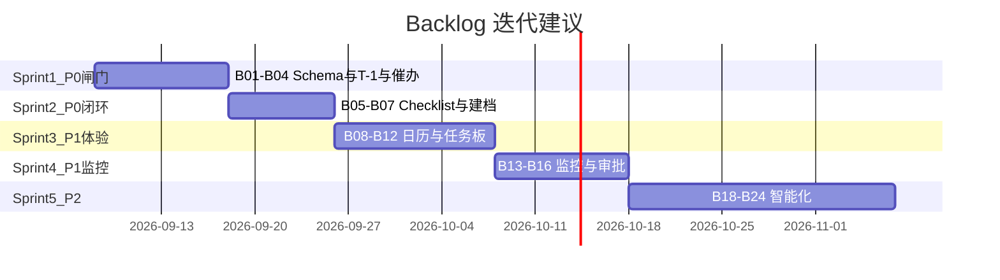

# SOP 对齐 · 开发 Backlog

> **版本**：v1.0-draft · 2026-09-04  
> **前提**：业务在 `docs/SOP_SIGNOFF_CHECKLIST.md` 签字确认后执行  
> **原则**：先 P0 闸门与字段，再 UX 与智能化增强

---

## 优先级定义

| 级别 | 含义 |
|---|---|
| **P0** | 不做则 SOP 无法跑通或闸门错误 |
| **P1** | 主路径可跑，但体验/规则明显偏离 SOP |
| **P2** | 增强项、可分期 |

---

## P0 · 必须先做

| ID | 项 | Agent/模块 | 来源 | 验收标准 |
|---|---|---|---|---|
| B01 | **标准活动 vs 创意活动** Schema 拆分 | Agent1 + Schema | Wiki 1.1/1.2 | 评审表单双模板；入库 `activity_type` |
| B02 | 创意活动扩展字段入库 | Agent1 + intel | Wiki 1.2 | 12+ 字段可读写、可导出日历 |
| B03 | **上线审核锚点 T-1**（替换 T-7 假设） | Agent4 + Schema | Wiki #9 | Checklist 触发日 = 上线前 1 天；Schema T 标签对齐 |
| B04 | **任务创建不通知 + 人工配置催办时间** | Agent3 + task_reminder | Wiki #8 | 创建任务零通知；每条任务可配 remind_at |
| B05 | 10 项上线 Checklist 结构化 | Agent4 | 8/13 会议 | 逐项勾选+阻断项；输出审核报告 |
| B06 | 日历字段 ↔ 活动文档字段一致性校验 | Agent1 | Wiki 1.5 | 不一致项阻断进入阶段 2 |
| B07 | proposal→adopted→建档 状态机 | Agent2 + lifecycle | 阶段 2 | 日历定稿条目一键建档 |

---

## P1 · 主路径对齐

| ID | 项 | Agent/模块 | 来源 | 验收标准 |
|---|---|---|---|---|
| B08 | 手机日历式月视图 | UI Agent1 | Wiki #5 | 月格展示活动；点击进详情 |
| B09 | 任务看板 CRUD（增删改完成态） | Agent3 UI/API | Wiki #6 | 运营可手工调整任务 |
| B10 | 三线任务模板（资源/策划/素材）可配置 | Agent2/3 | V4 + 会议 | T-8/T-4/T-2/T-1 模板可编辑 |
| B11 | MCP/QBI 圈选结果写回主档（不锁 ID） | Agent2 | 业务规则 | 分析建议可采纳/驳回 |
| B12 | GP 风控：TTV×1–2% + 高/中亏审批 | Agent2/4 | 道旅规则 | 超标进 human_gate |
| B13 | 监控字段维度配置 | Agent5 | Wiki #10 刘曼薇 | 看板列与 SOP 字段一致 |
| B14 | **上线次日监控总结推送** | Agent5 + 飞书 | Wiki #11 | 上线+1 天自动摘要 |
| B15 | 风险分级审批 UI（中/高） | Agent4 | V4 阶段 5 | 中风险待批；高风险退回 Agent2/3 |
| B16 | 临时活动立项入口 | Agent2 | 8/13 会议 | 非日历来源同主档流程 |
| B17 | AI 提示词六维配置化 | Agent1 | Wiki 1.3 | intel_tasks 可配维度 |

---

## P2 · 增强与智能化

| ID | 项 | Agent/模块 | 来源 | 验收标准 |
|---|---|---|---|---|
| B18 | 资源缺口 Top100 兜底 | Agent2 | V4 | 未达标自动补候选 |
| B19 | 跨材料一致性校验（券/素材/位置） | Agent4 | V4 | 自动比对+差异清单 |
| B20 | 复盘四库完整拆分 | Agent6 | 8/13 会议 | 案例/客户/酒店/标签四库 |
| B21 | **Agent 知识库问答**（反哺策划） | Agent6→Agent1 | Wiki #12 | 自然语言查历史案例 |
| B22 | 埋点/券系统对接 | Agent4/5 | V4 | 依赖外部 API 就绪 |
| B23 | 2027 人工规划维度规范文档+校验 | Agent1 | Wiki #13 | 郭毅勋维度入 Schema 提示 |
| B24 | 生产部署与数据留存策略 | infra | Wiki #4 | 郑泽明/廖秋霞环境 |

---

## 建议迭代顺序（签字后）

---

## 不在此次 Backlog（需业务另议）

- 自动改价/改预算（SOP 明确禁止，保持 human_gate）  
- 锁定酒店/客户 ID 写回（业务规则禁止）  
- 飞书 Wiki 画板自动同步（需 CLI/API 授权后单独立项）

---

## 变更记录

| 日期 | 说明 |
|---|---|
| 2026-09-04 | 初稿：Wiki 阶段 1 + 会议/V4 补全阶段 2–7 |
