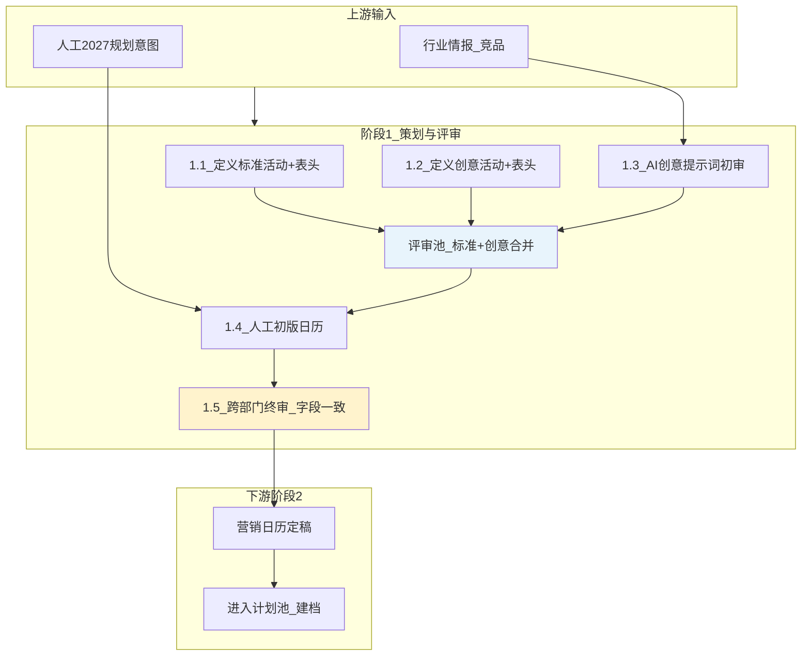

# 阶段 1 对齐稿：策划与评审

> 对应飞书 Wiki 1.1–1.5 · 2026-09-04  
> **Agent 归属（以 `config/agents.yaml` v6 为准）**：**营销策划 Agent**

---

## 1. 阶段摘要

| 维度 | 内容 |
|---|---|
| **干什么** | 人工规划标准活动 + AI 补充创意活动 → 合并评审池 → 负责人逐项评审 → 输出定稿营销日历 |
| **谁负责** | 军军、AI 小组（Jim 对接字段/提示词）；闸门 = 营销负责人 |
| **输入** | 2027 规划意图、行业/竞品情报、AI 创意采集 Prompt、人工初版日历 |
| **输出** | 《年度营销日历定稿》；每条活动带标准/创意类型及完整表头字段 |
| **人工闸门** | ① 评审池单项通过/驳回/修改 ② 跨部门终审字段一致性 ③ 初版日历是否需额外评审角色 |

---

## 2. Mermaid 流程图（阶段 1 + 上下游衔接）

---

## 3. 系统功能映射表

| 线下步骤 | 负责人 | 系统 Agent | 状态 | 现有模块 | 差距说明 |
|---|---|---|---|---|---|
| 1.1 标准活动生成 | 军军+AI | 营销策划 | **部分有** | `intel_service.py` 评审池、`activity_doc_parser.py` 日历 MD 导入 | 缺「活动类型=标准/创意」Schema 字段拆分；日历表头未区分两套字段集 |
| 1.2 创意活动+评审池 | 军军+AI | 营销策划 | **部分有** | 同上 + `data/intel_uploads/2027营销活动日历/` | 创意专属字段（洞察/契机/客群画像等）未入评审表单 |
| 1.3 AI 提示词初审 | AI→JIM | 营销策划 | **部分有** | `config/intel_tasks.yaml`、`agents.yaml` Agent1 prompt | 提示词维度与 Wiki 六维（名称/时间/城市/类型/客群/酒店）未完全对齐为可配置项 |
| 1.4 初版日历 | 军军 | 营销策划 | **已有** | 日历 MD + UI 评审 overlay（`app.js`） | 「是否需评审/评审人」流程未建模 |
| 1.5 跨部门终审 | 营销负责人 | 营销策划 | **部分有** | `campaign_plan_schema.py` v3 十三模块 | 日历视图字段 ≠ 点进活动文档字段的一致性校验缺失 |
| 数据留存 #4 | — | 全系统 | **已有** | SQLite + schema_v2 | 需确认生产部署与备份策略 |
| 日历 UX #5 | — | 营销策划 UI | **缺失** | 当前为列表/卡片 | 需「手机日历」式月视图 |
| 2027 规划维度 #13 | 郭毅勋 | 营销策划 | **部分有** | Agent1 输出 + 决策卡 | 人工规划逻辑/维度规范文档化待补 |

**图例**：已有 = 可跑通主路径；部分有 = 有原型缺字段/规则；缺失 = 未实现

---

## 4. 待你确认的问题（阶段 1）

1. **标准 vs 创意字段**：Wiki 列出的创意专属字段是否全部必填？标准活动是否允许后续「升级为创意」补填扩展字段？  
2. **评审闸门**：初版日历（1.4）除营销负责人外，是否固定需要资源/设计/数据方会签，还是按活动级别（S/A/B）可变？  
3. **日历 ↔ 文档**：点进活动后，是「同一套字段只读展开」，还是「日历精简字段 + 文档扩展模块」？系统应以哪种为准做校验？

---

## 5. 阶段 1 开发 Backlog 预览（签字后执行）

| 优先级 | 项 | 说明 |
|---|---|---|
| P0 | 标准/创意活动类型字段 | Schema + 评审表单双模板 |
| P0 | 评审池字段对齐 Wiki | 创意 12+ 扩展字段入库 |
| P1 | 日历↔文档字段一致性检查 | Agent1 终审闸门 |
| P1 | 手机日历月视图 | UI 新组件 |
| P2 | 提示词维度配置化 | `intel_tasks.yaml` + 管理 UI |
