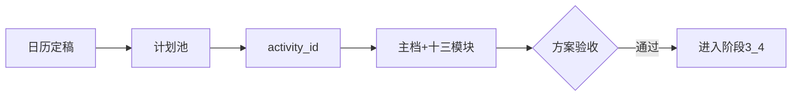
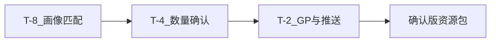
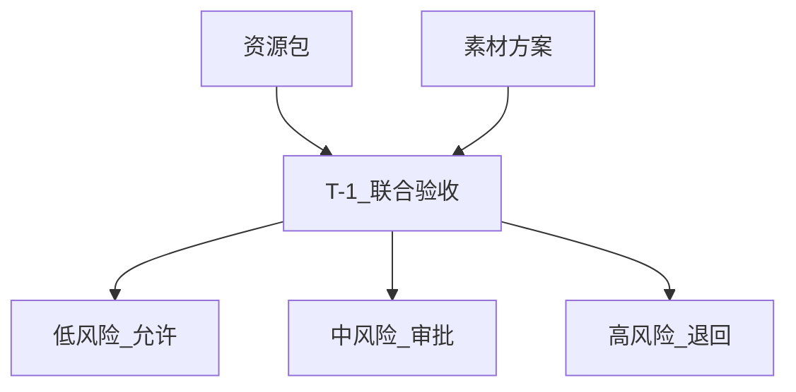
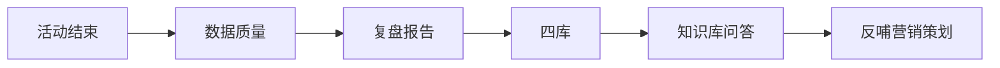

# 阶段 2–7 对齐稿（会议 + V4 补全 · 待 Wiki 校正）

> **说明**：飞书 Wiki 表格阶段 2–7 行为空；下文依据 `需求方会议总结_2026-08-13` + `AGENT_SCHEME_V4_SOP对齐.md` 整理。  
> **请你**：若有《网站活动营销SOP》完整文字，按阶段粘贴后可替换本稿。

---

## 阶段 2：立项 · 主档 · 方案梳理

**摘要**：日历定稿 → 计划池 → activity_id 建档 → Schema v3 十三模块 → 人工验收方案模块。  
**Agent**：方案策划（Agent2）  
**闸门**：标准化活动方案模块验收  

| 步骤 | 状态 | 差距 |
|---|---|---|
| 建档 | 部分有 | 状态机、临时活动入口 |
| 十三模块 | 已有 | 标准/创意未分支 |

**待确认**：T-8 自动入队是否对所有 adopted 活动生效？

---

## 阶段 3：资源准备线

**摘要**：T-8 画像匹配 → T-4 数量确认 → T-2 推送运营+GP 风控；负责人萧蓉。  
**Agent**：方案策划（分析）+ 任务监督（SLA）  

| 步骤 | 状态 | 差距 |
|---|---|---|
| MCP/QBI 圈选 | 部分有 | 规则可配置、兜底 Top100 缺失 |
| GP 1–2% | 部分有 | 审批流未接 |

**待确认**：缺口兜底 Top100 规则是否仍采用 V4 描述？

---

## 阶段 4：营销方案 · 素材线

**摘要**：T-2 简报 → T-2~T-1 素材 → T-1 运营审核；无独立 Agent，任务监督管 SLA。  
**Agent**：任务监督（Agent3）  

| 步骤 | 状态 | 差距 |
|---|---|---|
| 素材任务板 | 部分有 | demo 数据为主 |
| 交付验收 | 部分有 | 上传/验收未闭环 |

**待确认**：素材 SLA「约 1 周」是否写死还是按活动级别可变？

---

## 阶段 5：T-1 上线审核

**摘要**：资源线 + 素材线汇合 → 10 项 Checklist → 风险分级 → 预备上线池。  
**Agent**：上线审核（Agent4）  

| 步骤 | 状态 | 差距 |
|---|---|---|
| 10 项 Checklist | 部分有 | 未逐项结构化 |
| T-1 锚点 | **需改** | 代码/Schema 仍有 T-7 标签 |

**待确认**：10 项是否还需增减（相对 8/13 会议清单）？

---

## 阶段 6：监控优化

**摘要**：自动上下线 → 实时看板 → 异常诊断 → **上线次日总结推送** → 优化建议（不改价）。  
**Agent**：监控优化（Agent5）  

| 步骤 | 状态 | 差距 |
|---|---|---|
| 看板 | 部分有 | 字段维度待刘曼薇 |
| 次日总结 | 缺失 | Wiki #11 |

**待确认**：次日总结推送渠道（飞书群 / 个人）与接收人规则？

---

## 阶段 7：复盘归档

**摘要**：数据质量审核 → 复盘报告 → 有产客户/酒店清单 → 四库 → 反哺营销策划 + 知识库问答。  
**Agent**：复盘归档（Agent6）  

| 步骤 | 状态 | 差距 |
|---|---|---|
| 复盘报告 | 部分有 | 三步结构待对齐 |
| 知识库问答 | 缺失 | Wiki #12 |

**待确认**：四库是否仍按会议「案例/客户画像/高产酒店/标签规则」四分？

---

## 汇总：阶段 2–7 系统状态

| 阶段 | 已有 | 部分有 | 缺失 | 需改 |
|---|---|---|---|---|
| 2 | 1 | 2 | 1 | 0 |
| 3 | 0 | 2 | 1 | 0 |
| 4 | 0 | 2 | 0 | 0 |
| 5 | 0 | 2 | 2 | 1 |
| 6 | 0 | +2 | 1 | 0 |
| 7 | 0 | 3 | 1 | 0 |

详细映射见 `docs/SOP_SYSTEM_MAPPING.md` · 开发项见 `docs/SOP_DEV_BACKLOG.md`
