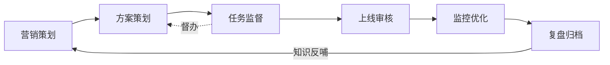

# SOP ↔ 系统功能总映射表

> **版本**：v1.0-draft · 2026-09-04  
> **Agent 命名**：以 `config/agents.yaml`（architecture v6）为准  
> **阶段 2–7**：Wiki 表格为空，依据 8/13 会议 + V4 SOP 补全，**待业务校正**

---

## 1. 六 Agent 与七阶段总表

| Agent | 配置名 | 主责阶段 | 一句话 |
|---|---|---|---|
| **Agent1** | 营销策划 | 1（+2 日历定稿衔接） | 评审池、AI 创意、日历定稿 |
| **Agent2** | 方案策划 | 2–4（建档+圈选+任务拆解） | 主档、MCP/QBI 分析、三线任务池 |
| **Agent3** | 任务监督 | 2–6（贯穿） | 依赖、催办、验收、延期预警 |
| **Agent4** | 上线审核 | 5 | T-1 Checklist、风险分级 |
| **Agent5** | 监控优化 | 6 | 看板、诊断、次日总结 |
| **Agent6** | 复盘归档 | 7 | 复盘报告、四库、知识反哺 |

---

## 2. 分阶段映射明细

### 阶段 1 · 策划与评审 → Agent1 营销策划

详见 `docs/SOP_PHASE1_ALIGNMENT.md`。

| 状态汇总 | 数量 |
|---|---|
| 已有 | 1（初版日历/导入） |
| 部分有 | 5 |
| 缺失 | 1（手机日历 UX） |

---

### 阶段 2 · 立项建档 → Agent2 方案策划

| 线下步骤 | 系统 Agent | 状态 | 模块 | 差距 |
|---|---|---|---|---|
| 2.1 计划池采纳 | Agent2 | 部分有 | `lifecycle_service.py` | proposal→adopted 状态机不完整 |
| 2.2 activity_id 建档 | Agent2 | 部分有 | `agent2_resource.py`、`campaign_plan_schema.py` | 标准/创意双模板未分支 |
| 2.3 方案十三模块 | Agent2 | 已有 | Schema v3 + UI 评审 overlay | 模块验收闸门 UI 弱 |
| 2.4 临时活动入口 | Agent2 | 缺失 | — | 非日历立项流程未做 |
| T-8 进入准备队列 | Agent3 | 部分有 | `orchestrator.py` | 自动触发规则与 leading date 待对齐 |

---

### 阶段 3 · 资源线 → Agent2 分析 + Agent3 督办

| 线下步骤 | 系统 Agent | 状态 | 模块 | 差距 |
|---|---|---|---|---|
| T-8 酒店画像匹配 | Agent2 | 部分有 | `resource_prep_analysis.py` MCP/QBI | 画像规则可配置化不足 |
| T-4 数量确认 | Agent3 | 部分有 | `fact_activity_todos` | 资源线 SLA 模板硬编码 |
| T-2 GP 风控 | Agent2 | 部分有 | `adjust_gp_rate.py`、TTV×1–2% | 高/中亏审批流未接 |
| 缺口兜底 Top100 | Agent2 | 缺失 | — | V4 兜底逻辑未实现 |

---

### 阶段 4 · 方案素材线 → Agent3 任务监督（无独立 Agent）

| 线下步骤 | 系统 Agent | 状态 | 模块 | 差距 |
|---|---|---|---|---|
| T-2 创意简报 | Agent3 | 部分有 | 任务板 demo 数据 | 素材线模板与 SLA 未配置化 |
| 素材制作 T-2~T-1 | Agent3 | 部分有 | `campaign_plan_schema` 素材字典 | 交付物上传/验收未闭环 |
| T-1 运营审核方案 | Agent3 | 部分有 | UI 任务状态 | 与资源线汇合节点未显式 |

---

### 阶段 5 · T-1 上线审核 → Agent4 上线审核

| 线下步骤 | 系统 Agent | 状态 | 模块 | 差距 |
|---|---|---|---|---|
| 10 项 Checklist | Agent4 | 部分有 | `agent4` router/service | 10 项未逐项结构化 |
| 跨材料一致性 | Agent4 | 缺失 | — | 资源↔券↔素材校验 |
| 风险分级 | Agent4 | 部分有 | `agents.yaml` human_gates | 中/高审批 UI 未做 |
| **T-1 非 T-7** | Agent4 | **需改** | Schema 中仍有 T-7周标签 | 锚点与催办/审核统一改 T-1 |
| GP/埋点验证 | Agent4 | 缺失 | — | 外部系统对接待定 |

---

### 阶段 6 · 监控优化 → Agent5 监控优化

| 线下步骤 | 系统 Agent | 状态 | 模块 | 差距 |
|---|---|---|---|---|
| 实时看板 | Agent5 | 部分有 | `agent3_monitor.py`、`homepage_metrics.py` | 字段维度待刘曼薇对齐 #10 |
| 异常诊断 | Agent5 | 部分有 | `campaign_diagnosis.py` | 四象限规则待确认 |
| **上线次日总结** | Agent5 | 缺失 | — | Wiki #11 未实现 |
| 改价改预算闸门 | Agent5 | 部分有 | prompt 约束 | 审批 UI 未做 |

---

### 阶段 7 · 复盘归档 → Agent6 复盘归档

| 线下步骤 | 系统 Agent | 状态 | 模块 | 差距 |
|---|---|---|---|---|
| 复盘报告 | Agent6 | 部分有 | `agent5_archive.py` | 三步复盘结构待对齐 |
| 有产客户/酒店清单 | Agent6 | 部分有 | archive API | 导出格式待确认 |
| 四库沉淀 | Agent6 | 部分有 | `dim_activity_archive` | 四库拆分未完整 |
| **Agent 知识库问答** | Agent6→Agent1 | 缺失 | — | Wiki #12 RAG 未做 |
| 反哺日历 | Agent6→Agent1 | 部分有 | `intel_service` | 自动建议未闭环 |

---

## 3. 跨阶段系统能力（Wiki 问题清单）

| # | 要求 | 主责 Agent | 状态 | 说明 |
|---|---|---|---|---|
| 4 | 数据存库留存 | 全系统 | 已有 | SQLite；生产部署待郑泽明 |
| 5 | 手机日历 UX | Agent1 UI | 缺失 | |
| 6 | 任务完成标记；看板增删 | Agent3 UI | 部分有 | UI 多为 demo，缺 CRUD API |
| 7 | 催办频次规则 | Agent3 | 待业务定 | |
| 8 | 创建不通知；人配催办时间 | Agent3 | **需改** | 现有三档自动催办，缺「创建静默+人工配置」 |
| 9 | 审核 T-1 非 T-7 | Agent4 | **需改** | |
| 10 | 监控字段维度 | Agent5 | 待刘曼薇 | |
| 11 | 上线次日总结推送 | Agent5 | 缺失 | |
| 12 | 复盘+知识库问答 | Agent6 | 缺失 | |
| 13 | 2027 规划维度 | Agent1 | 部分有 | |

---

## 4. 与旧文档差异说明

| 文档 | 差异 |
|---|---|
| `AGENT_SCHEME_V4_SOP对齐.md` | 旧六 Agent 命名（资源/素材独立 Agent）；**以 v6 `agents.yaml` 为准** |
| `AGENT_DEFINITION_V6.md` | Agent2=筹备、Agent3=催办；**代码已合并为 Agent2 方案策划 + Agent3 任务监督** |
| Wiki 画板 | 无法自动读取节点；**以本映射表 + 你的文字校正为准** |

---

## 5. 相关文档

- 线下总流程：`docs/SOP_V1_OFFLINE_FLOW.md`  
- 阶段 1 详稿：`docs/SOP_PHASE1_ALIGNMENT.md`  
- 开发 Backlog：`docs/SOP_DEV_BACKLOG.md`  
- 签字清单：`docs/SOP_SIGNOFF_CHECKLIST.md`
