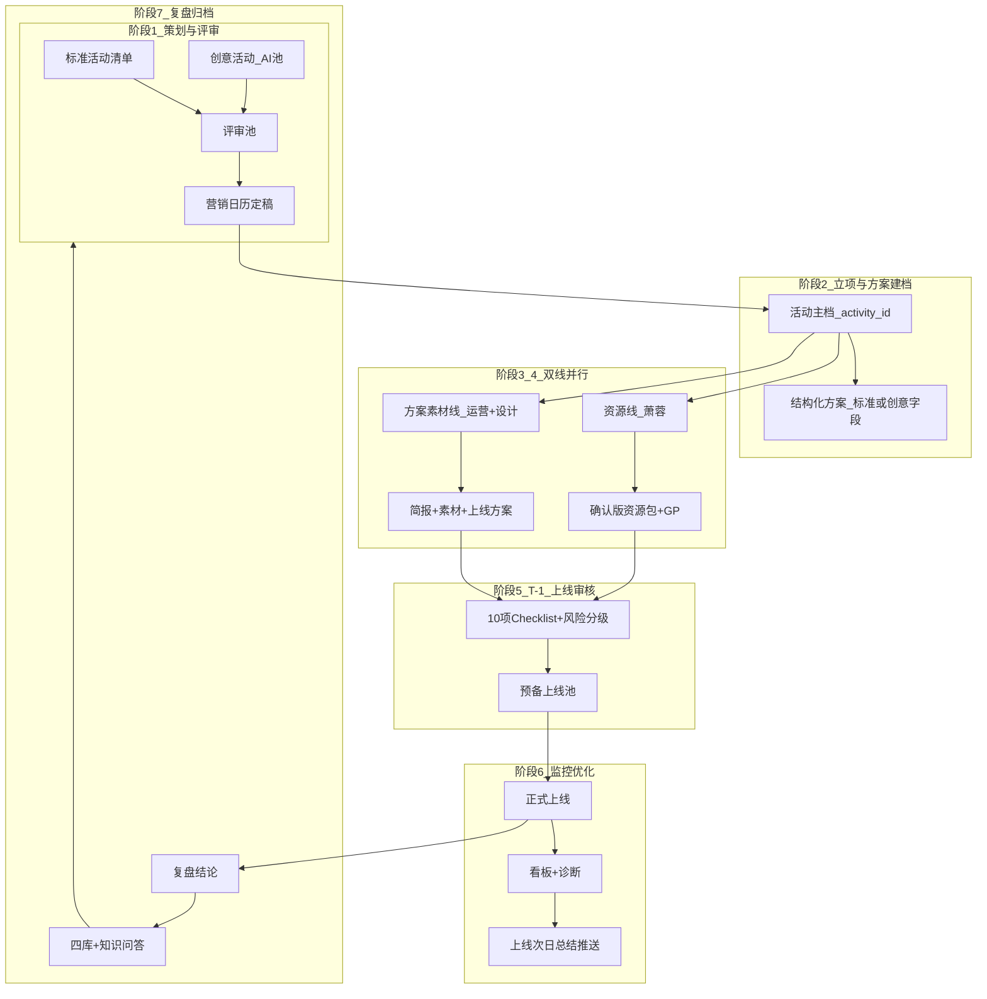

# 网站活动营销 SOP v1（线下流程 · 待业务签字）

> **版本**：v1.0-draft · 2026-09-04  
> **来源**：飞书 Wiki《营销协作系统流程问题档案》阶段 1 + 8/13 会议七段 + V4 SOP 七阶段 + Wiki 问题清单 4–13  
> **状态**：**草案 — 阶段 2–7 表格在 Wiki 为空，已用会议/V4 补全，请你逐段校正**

---

## 0. 三条原则

1. **业务优先**：自动化规则来自人工判断，不反推业务  
2. **人机协同**：AI 做采集/催办/统计；评审、资源确认、改价改预算必须人工  
3. **系统为管控中枢**：营销 + 临时活动全流程状态、待办、交付、验收均在系统内可追溯  

---

## 1. 全流程总览（七阶段）

**关键调整（Wiki 已确认）**  
- 上线审核：**T-1**，不是 T-7  
- 任务创建：**不立即通知**；催办时间由**人配置**  
- GP 估算：预订 GP = TTV × **1%–2%**（道旅 Shopping 活动区间）

---

## 2. 阶段 1：营销活动策划和评审

**负责**：军军 + AI 小组（Jim 对接字段/提示词） · **闸门**：营销负责人逐项评审  

| 子流程 | 任务 | 产出 |
|---|---|---|
| 1.1 活动生成 | 定义标准活动及表头 | 标准活动档案字段集 |
| 1.2 合并评审池 | 定义创意活动及表头、主题类型 | 创意活动档案字段集 |
| 1.3 部门内初审 | AI 创意提示词（名称/上线/目的地/类型/客群/酒店画像） | 提示词 v1 + JIM 调优机制 |
| 1.4 初版日历 | 人工 2027 初版；定是否评审、评审人 | 初版日历 |
| 1.5 跨部门终审 | 日历字段 = 点进活动文档字段 | 《年度营销日历定稿》 |

### 2.1 标准活动 vs 创意活动

| 类型 | 定义 | 日历字段（最小集） |
|---|---|---|
| **标准活动** | 大型节假日等「本来就要做」 | 主题名称、类型=标准、推广月、上线位置/时间、目的地层级、选择理由 |
| **创意活动** | 数据洞察共性需求后的推广机会 | 标准字段 + 主题词、数据洞察、需求背景、契机、机会判断、创意、客群画像、需求规模、目标、酒店画像 |

---

## 3. 阶段 2：活动立项 · 主档 · 方案梳理

**负责**：营销师 · **闸门**：方案模块验收  

| 步骤 | 线下动作 | 产出 |
|---|---|---|
| 2.1 采纳进计划池 | 日历定稿条目进入「全年计划池」 | 活动 proposal → adopted |
| 2.2 建档 | 生成 activity_id；写入基本信息+筹备信息 | 活动主档 |
| 2.3 方案结构化 | 按活动类型填标准/创意字段；扩展为 Schema v3 十三模块 | plan_structured_json |
| 2.4 临时活动 | 非日历入口立项（会议共识） | 同主档，来源=临时 |

**T 锚点**：距上线 **T-8** 自动进入准备队列（V4 SOP；亚洲≥90天、非亚洲≥180天 与 Agent1 一致）

---

## 4. 阶段 3：资源准备线

**负责**：萧蓉（资源） · **闸门**：资源确认；高/中亏 GP 审批  

| 节点 | 线下动作 | 产出 |
|---|---|---|
| T-8 | 按酒店画像匹配清单 | 候选酒店池 |
| T-4 | 数量达标确认、缺口识别 | 确认版清单 v1 |
| T-2 | 推送运营；比价验价；GP 风控 | 资源包 + GP 报告 |

**兜底**：未达标 → Top100 热销 ∩ 高请求 UV 补齐（V4；规则待萧蓉确认）

---

## 5. 阶段 4：营销方案线（人工为主）

**负责**：运营 + 梓淮（设计） · **Agent**：无独立 Agent；由**任务监督**管 SLA  

| 节点 | 线下动作 | SLA（V4） |
|---|---|---|
| T-2 | 创意简报 | 2 日内 |
| T-2~T-1 | 素材制作（Banner/专题/券物料） | ~1 周 |
| T-1 | 运营审核上线方案 | 与资源线汇合 |

---

## 6. 阶段 5：上线准备 · 联合验收（T-1）

**负责**：营销负责人 + 上线审核 · **闸门**：中风险审批；高风险退回  

**10 项确认**（8/13 会议 + V4）：

1. 位置（Banner/二级 Banner/广告位）  
2. 图片海报/素材  
3. 目标与成功标准  
4. 资源（酒店画像、数量、交付状态）  
5. 客户群（圈选逻辑、规模）  
6. 优惠券配置  
7. 上下线时间  
8. 过程数据字段/埋点  
9. 看板呈现形式  
10. 目标达成计算方式  

**风险分级**：低→允许上线；中→负责人批；高→整改重审  

---

## 7. 阶段 6：正式上线 · 监控优化

**负责**：营销师 + 刘曼薇（字段） · **闸门**：改价/改预算须审批  

| 步骤 | 线下动作 |
|---|---|
| 6.1 | 按设定时间自动上下线 |
| 6.2 | 日采：曝光/点击/CTR/CVR/GMV/GP/取消率 |
| 6.3 | 异常诊断（曝光/CTR/CVR/GP 四象限） |
| 6.4 | **上线次日**：监控总结自动推送（Wiki #11） |
| 6.5 | 优化建议；不自动改价 |

---

## 8. 阶段 7：复盘 · 归档 · 反哺

**负责**：营销负责人 + JIM（复盘维度） · **闸门**：复盘结论人工确认  

| 步骤 | 产出 | 入库 |
|---|---|---|
| 7.1 数据质量审核 | 可信/不可信标记 | — |
| 7.2 复盘报告 | 结论、标签、优化项 | 案例库 |
| 7.3 有产清单 | 客户清单、酒店清单 | 客户画像库、高产酒店库 |
| 7.4 知识反哺 | 活动标签、避坑规则 | 反哺营销策划 + **Agent 知识库问答**（Wiki #12） |

---

## 9. 待业务确认的差异点

| # | 问题 | 当前草案取值 |
|---|---|---|
| Q1 | 阶段 2–7 Wiki 表格为空，V4/会议补全是否准确？ | 见上文，待你逐段校正 |
| Q2 | Agent2「方案策划」是否兼做任务拆解，还是拆给独立「筹备 Agent」？ | 以 `config/agents.yaml`：Agent2 建档+MCP+拆解，Agent3 督办 |
| Q3 | 「手机日历」是月格视图还是周/日时间轴？ | 待 UI 确认 |
| Q4 | 催办具体：中点/截止前1天/当天 — 是否三档默认？ | 见 task_reminder 现有逻辑，待对齐 #7 |

---

## 10. 相关文档

- 飞书导入原文：`docs/feishu_import/营销协作系统流程问题档案.md`  
- 系统映射：`docs/SOP_SYSTEM_MAPPING.md`  
- 开发 Backlog：`docs/SOP_DEV_BACKLOG.md`  
- 签字清单：`docs/SOP_SIGNOFF_CHECKLIST.md`
