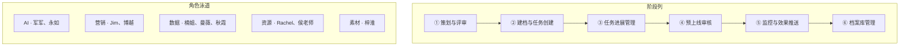

# 营销 SOP v2 · 以画板泳道为准（最新流程）

> **权威来源**：飞书 Wiki 内嵌画板（非 Wiki 表格）  
> **画板 token**：`OgJcwdUfQhIHffbLjzLcmDJ2n3c`（泳道主看板）+ `BftawFL9thBCDVbA6awcgg27nbd`（上方简图）  
> **Wiki 表格**：仅阶段 1 有文字；**整体以本画板为准**

---

## 1. 六阶段 × 五泳道总览



---

## 2. 子步骤清单（画板编号）

| 阶段 | 子步骤 | 节点名 |
|---|---|---|
| **1 营销活动策划和评审** | 1.1 | 活动生成 |
| | 1.2 | 合并进入评审池 |
| | 1.3 | 部门内初审（AI 提示词） |
| | 1.4 | 初版日历生成 |
| | 1.5 | 跨部门终审 |
| **2 建档和任务创建** | 2.1 | 活动建档（标准/创意/临时分类） |
| | 2.2 | 全年营销日历看板 |
| **3 活动任务进展管理** | 3.1 | 任务配置 |
| | 3.2 | 执行任务 |
| | 3.3 | 任务催办 |
| | 3.4 | 验收 |
| **4 活动预上线审核** | 4.1 | 提醒审核（**T-1**） |
| | 4.2 | 预上线审核 |
| **5 上线监控与效果推送** | 5.1 | 活动上线 |
| | 5.2 | 数据看板 |
| | 5.3 | 监控总结（**T+1 推送**） |
| | 5.4 | 下线活动复盘 |
| **6 档案库管理** | 6.1 | 沉淀知识库 |
| | 6.2 | 知识库问答 |

---

## 3. 泳道主路径（按画板连线）

### 阶段 1 · 策划与评审

| 泳道 | 动作 | 产出 |
|---|---|---|
| **AI** | 根据人工规划逻辑生成全年日历；AI 提示词设计创意日历；合并标准+创意进评审池 | AI 创意池、2027 AI 日历 |
| **营销** | 部门内评审 → 初版日历 → 跨部门终审 | 终版营销日历 |
| **数据** | （待定）支持 Jim 人工规划逻辑的数据字段 | 规划数据支持 |
| **跨部门** | 参与终审 | 评审结论 |

**分支**：`新增临时活动` 从阶段 1 侧边进入，后续走阶段 2 建档。

**评审池字段（便签）**：月份、活动名称、活动来源（经验规划/AI创意）、活动类型、活动月份、活动目的地、评审入口（采纳/拒绝）

---

### 阶段 2 · 建档和任务创建

| 泳道 | 动作 |
|---|---|
| **营销** | 活动建档；生成档案模板、补全缺失字段；建立营销活动看板 |
| **AI** | 辅助字段补全 |
| **营销+Jim** | 确认建档字段与评审字段是否一致 |

**看板要求**：类似手机日历；未来 30/60/90 天任务进展（甘特）；人工增删查改。

---

### 阶段 3 · 任务进展管理

| 泳道 | 动作 |
|---|---|
| **营销** | 任务配置；营销接受任务 → 执行任务 |
| **资源** | 资源接受任务 → 执行任务 |
| **素材** | 素材接受任务 → 执行任务 |
| **AI/系统** | 任务催办（**创建不通知，人配发送时间**） |
| **营销** | 任务验收 |

**循环**：任务没有完成 → 回到执行任务；任务完成 → 进入阶段 4。

**Jim/Rachel 待输出**：任务名称、类型、T 节点（如 T-7）、催办次数。

---

### 阶段 4 · 预上线审核

| 泳道 | 动作 |
|---|---|
| **AI** | 上线前 **T-1** 提醒审核 |
| **营销** | 预上线审核（Jim 输出审核维度与标准） |

---

### 阶段 5 · 监控与效果推送

| 泳道 | 动作 |
|---|---|
| **营销** | 活动上线 |
| **数据/曼薇** | 按字段形成数据看板（标准型/创意型分列） |
| **AI/系统** | T+1 推送监控总结 |
| **营销/Jim** | 下线活动复盘（⑦ 段复盘模板） |

---

### 阶段 6 · 档案库管理

| 泳道 | 动作 |
|---|---|
| **全员沉淀** | 飞书知识库 + 数据入库（MCP 接表） |
| **AI** | 知识库问答助手 → **反哺阶段 1** |

---

## 4. 与 6 Agent 系统映射（草案）

| 画板阶段 | 系统 Agent | 说明 |
|---|---|---|
| 1 策划与评审 | **营销策划** | 评审池、AI 池、日历定稿 |
| 2 建档与任务创建 | **方案策划** | 建档、看板、任务池生成 |
| 3 任务进展管理 | **任务监督** | 配置/催办/验收；资源素材营销三线 |
| 4 预上线审核 | **上线审核** | T-1 提醒 + Checklist |
| 5 监控与推送 | **监控优化** | 看板 + T+1 总结 + 复盘入口 |
| 6 档案库 | **复盘归档** | 知识库 + 问答反哺 |

---

## 5. 画板上的待办 / 未决（开发前先确认）

| 负责人 | 待输出 |
|---|---|
| **Jim** | 任务清单（T 节点/催办次数）；审核维度表；复盘模板定稿；人工规划全年日历 SOP |
| **Jim+Rachel** | 资源/素材/营销任务配置明细 |
| **曼薇** | 监控字段（标准/创意分列） |
| **Jim** | 建档字段 vs 评审字段是否一致 |
| **待定** | 外部用户是否要账号体系与权限隔离 |

---

## 6. 文档优先级

```
画板泳道（本文件）  >  Wiki 问题清单  >  Wiki 表格（仅阶段1）
```

旧版「七阶段」草案作废，以本 **六阶段画板** 为准。
