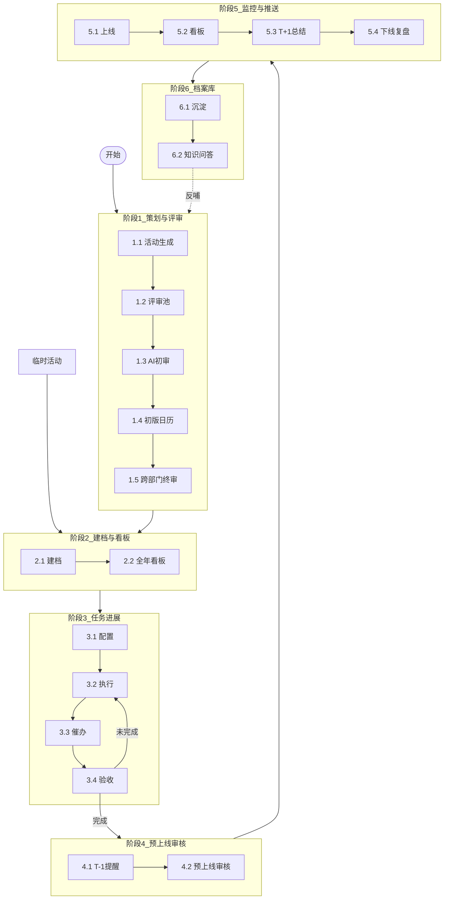
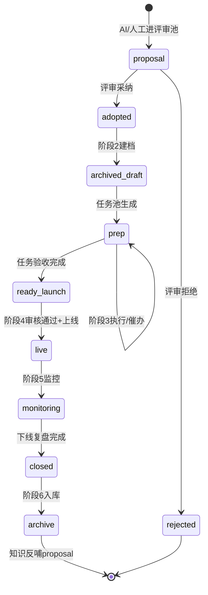
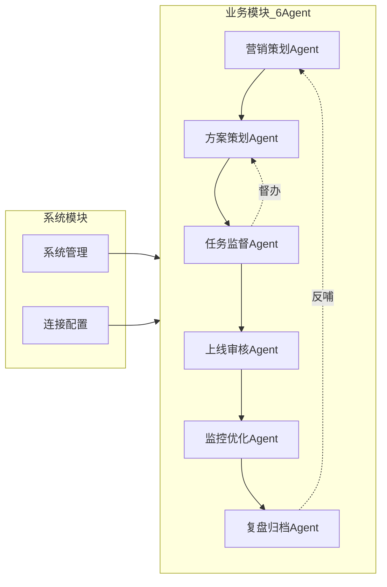

# 多 Agent 营销协作系统 · 系统设计方案 v2

> **版本**：v2.0-draft · 2026-09-07  
> **SOP 来源**：飞书画板六阶段泳道（待业务文字最终校正）  
> **用途**：团队演示 · 技术评审 · Demo 开发基线  
> **分阶段详稿**：[`SYSTEM_DESIGN_v2_Phase1.md`](SYSTEM_DESIGN_v2_Phase1.md) · [`SYSTEM_DESIGN_v2_Phase2-6.md`](SYSTEM_DESIGN_v2_Phase2-6.md)

---

## 1. 文档说明

本方案将 **线下 SOP（六阶段）** 翻译为 **系统业务流程、模块划分、功能清单、对象状态流转**。细节 I/O 与判断机制待 Jim / 永如 / 曼薇 / Rachel 提供后，通过 **占位配置** 填入，不改模块架构。

**演示目标**：团队可对照「业务在干什么 ↔ 系统对应什么模块/功能/状态」。

---

## 2. 业务总流程

### 角色泳道

| 角色 | 人员 | 主责阶段 |
|---|---|---|
| AI | 军军、永如 | 1 创意/提示词；4 T-1 提醒；5 T+1；6 问答 |
| 营销 | Jim、博越 | 1 评审；2 建档；3 配置/验收；4 审核；5 复盘 |
| 数据 | 楠姐、曼薇、秋霞 | 1 规划数据；5 看板字段 |
| 资源 | Rachel、侯老师 | 3 资源线执行 |
| 素材 | 梓淮 | 3 素材线执行 |

### 关键业务规则

| 规则 | 说明 |
|---|---|
| 只要 AI 池 | 人工规划与 AI 创意同一评审池 |
| T-1 审核 | 非 T-7 |
| T+1 总结 | 上线次日监控推送 |
| 催办 | 创建不通知；人配发送时间 |
| GP | TTV × 1%–2% |
| 活动类型 | 标准 / 创意 / 临时 |

---

## 3. 系统总流程（对象状态）

**核心对象**：活动主档（activity_id）、评审条目、任务（资源/方案/素材）、审核单、监控快照、归档记录。

---

## 4. 模块架构

| 阶段 | Agent | 代码主路径 |
|---|---|---|
| 1 | 营销策划 | `agent1_planner.py`, `intel_service.py` |
| 2 | 方案策划 | `agent2_resource.py`, `resource_prep_analysis.py` |
| 3 | 任务监督 | `task_reminder.py`, `lifecycle_service.py` |
| 4 | 上线审核 | `routers/agent4.py` |
| 5 | 监控优化 | `agent3_monitor.py`, `campaign_diagnosis.py` |
| 6 | 复盘归档 | `agent5_archive.py` |
| — | 系统管理 | `system_admin.py`, `module_registry.py` |

---

## 5. 模块功能详表（26 项）

见 [`config/modules.yaml`](../config/modules.yaml) 与 Demo **系统管理 → 模块总览**。

| 阶段 | 功能数 | 占位待填 |
|---|---|---|
| 1 | 7 | ai_creative, manual_plan_sop |
| 2 | 3 | archive_field_spec |
| 3 | 4 | task_templates |
| 4 | 3 | launch_checklist |
| 5 | 4 | monitor_fields, review_template |
| 6 | 2 | — |
| 系统 | 4 | — |

---

## 6. 业务逻辑 vs 系统逻辑对照（演示用）

| 业务环节 | 业务在干什么 | 系统模块 | 系统功能 | 系统状态/对象 |
|---|---|---|---|---|
| 1.1–1.2 | 定义标准/创意，进评审池 | 营销策划 | 字段Schema、评审池 | proposal |
| 1.3 | AI 生成创意 | 营销策划 | 提示词+LLM | pending 建议 |
| 1.4–1.5 | 日历与终审 | 营销策划 | 日历定稿 | adopted |
| 2.1 | 建档 | 方案策划 | activity_id 主档 | archived_draft |
| 2.2 | 全年看板 | 方案策划 | 日历/甘特 UI | prep 队列 |
| 3.1 | 配任务 | 任务监督 | 三线模板 | fact_activity_todos |
| 3.2–3.3 | 执行催办 | 任务监督 | 看板+Webhook | todo 状态 |
| 3.4 | 验收 | 任务监督 | 完成/回退 | ready_launch |
| 4.1–4.2 | T-1 审核 | 上线审核 | 提醒+Checklist | 审核单 |
| 5.1–5.3 | 上线监控 | 监控优化 | 看板+T+1推送 | live |
| 5.4 | 复盘 | 复盘归档 | 复盘报告 | closed |
| 6.1–6.2 | 知识库 | 复盘归档 | 入库+问答 | archive → 反哺 |

---

## 7. 技术方案摘要

| 层级 | 选型 |
|---|---|
| 后端 | Python 3.11 + FastAPI |
| 前端 | 内网工作台 HTML/JS |
| 数据库 | SQLite（Demo）/ PostgreSQL（生产） |
| AI | 通义/DeepSeek（可配置） |
| 数仓 | Warehouse MCP |
| 协作 | 飞书日历、Webhook、Wiki |
| 配置 | YAML：agents、modules、prompts |
| 运维 | system_logs + 系统管理 UI |

详见 [`SYSTEM_DEV_PRD_v1.md`](SYSTEM_DEV_PRD_v1.md) §6。

---

## 8. Demo 范围

**演示路径**（工作台 → SOP 业务对照）：

1. 首页 → **SOP 六阶段对照图** → 点击各阶段进对应 Agent  
2. **样例活动**（新加坡 F1）展示 1→6 状态条  
3. **系统管理** → 模块总览 26 项 + 占位配置 + 日志  

**不做**：Jim 未给规则硬编码、生产权限、真实全量对接。

---

## 9. 占位清单（待业务填）

| key | 负责人 | 用途 |
|---|---|---|
| ai_creative | 永如 | AI 创意提示词 |
| manual_plan_sop | Jim | 人工规划 SOP |
| task_templates | Jim+Rachel | 任务模板 |
| launch_checklist | Jim | 预上线审核 |
| monitor_fields | 曼薇 | 监控字段 |
| review_template | Jim | 复盘模板 |
| archive_field_spec | Jim | 建档字段对照 |

填入：**系统管理 → 占位配置** 或 `config/prompts/*.yaml`。

---

## 10. 确认与签字

见 [`SYSTEM_DESIGN_v2_SIGNOFF.md`](SYSTEM_DESIGN_v2_SIGNOFF.md) · [`TECH_REVIEW_CHECKLIST.md`](TECH_REVIEW_CHECKLIST.md)

**替换说明**：你逐阶段发送的文字将替换本 draft 中对应章节，版本升为 v2.1。

---

## 附录 · 版本记录

| 版本 | 日期 | 说明 |
|---|---|---|
| v2.0-draft | 2026-09-07 | 画板六阶段合并稿 + Demo 基线 |
