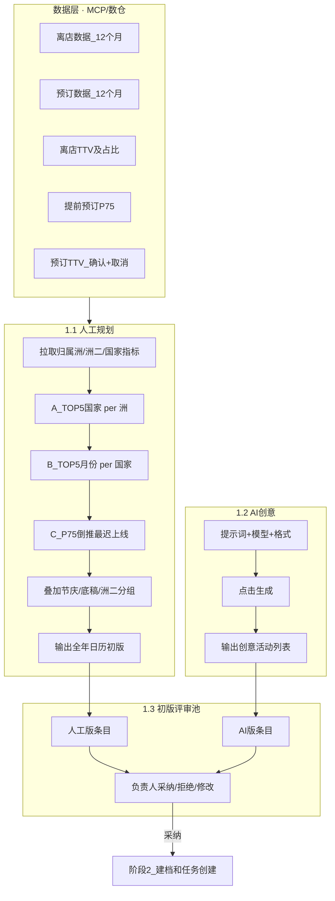

# 系统设计方案 v2 · 阶段 1：营销活动策划

> **SOP 来源**：业务文字（石军军 · 2026-09-07）+ 飞书表格 [`2027年营销日历-初版`](https://didatravel.feishu.cn/wiki/JAulw5Ev7iCHNXkqlZ4cGT5znvh)  
> **状态**：v2.1-phase1 · 已替换画板 draft  
> **系统模块**：营销策划 Agent（agent1）

---

## 1. 环节摘要

| 维度 | 内容 |
|---|---|
| **干什么** | 线下第一步「营销活动策划」：**人工按数据分析**产出下一年 1–12 月活动规划初版；**AI 按提示词**产出创意活动方案；两版汇入 **初版评审池**，由营销活动负责人审核 |
| **谁负责** | **人工规划**：营销负责人（Jim 侧）+ 数据支持（楠姐/曼薇/秋霞 拉数）；**AI 生成**：永如 配提示词 + 系统调用 LLM；**评审**：营销活动负责人 |
| **输入（人工）** | 数仓/MCP：过去 12 个月（例：2025-08～2026-07）按 **归属洲 / 归属洲二 / 国家** 的离店 TTV、预订 TTV、离店订单数、预订订单数；P75 提前预订天数；业务底稿目的地清单 |
| **输入（AI）** | AI 创意提示词（永如）、输出格式模板、可选情报/日历参考 |
| **输出** | ① 人工版《全年营销日历初版》（结构化表格）② AI 版《创意活动列表》③ 评审池待审条目（带来源标记：人工规划 / AI 创意） |
| **人工闸门** | 营销活动负责人在 **初版评审池** 对每条活动 **采纳 / 拒绝 / 修改**；未采纳不进入下游 |
| **下游衔接** | 评审 **采纳** 的条目 → 进入阶段 2「建档和任务创建」；临时活动可旁路建档（待阶段 2 文字确认） |

### 1.1 人工规划 · 数据分析逻辑（业务权威）

**数据拉取范围**（滚动 12 个月，例 2025-08～2026-07）：

| 维度 | 字段 |
|---|---|
| 地理 | 归属洲、归属洲二（业务二级分组）、国家 |
| 交易 | 每月离店 TTV、每月预订 TTV（确认+取消） |
| 订单 | 每月离店订单数、每月预订订单数 |
| 提前量 | P75 = 75% 离店订单的平均提前预订天数（按目的地/月份） |

**分析三步（A → B → C）**：

| 步骤 | 逻辑 | 业务结论 |
|---|---|---|
| **A** | 每个大洲下，按 TTV/订单贡献排序 **TOP5 国家** | 该洲主要做哪些国家的活动 |
| **B** | 每个国家 12 个月中，按「当月离店 TTV ÷ 12 个月总 TTV」排序 **TOP5 月份** | 该国活动主要落在哪几个月（旺季/高峰） |
| **C** | 取目标月份对应 **P75 提前天数** | **活动最迟上线时间** = 目标入住/离店高峰月 − P75 天（向前倒推） |

**归属洲二（二级分组）**：业务按旅游产品线路经验对国家分组，活动以 **组** 为单位策划（例：澳新 = 澳大利亚+新西兰；东南亚 = 泰/越/新/马/印尼等）。分析、排期、主题均可在「洲二」粒度汇总，详见飞书表「27年营销日历逻辑」子表。

**总体一句话**：全球每个大洲 → 主产国家 → 各国订单入住高峰月份 → 高峰订单平均提前预订天数 → **活动最迟上线时间**；再叠加节庆/展会/业务底稿目的地，形成全年日历初版。

**飞书表结构参考**（人工产出格式）：

| 列 | 含义 |
|---|---|
| 活动场次 | 按上线月份分批（如 1 月场、2 月场） |
| 月度主要主题 | 当月总主题 |
| 细分活动主题 | 按目的地/区域 |
| 覆盖目的地/城市 | 具体覆盖范围 |
| 对应出游/促销月份 | 目标离店/入住高峰 |
| 关键 P75 | 该目的地目标月的提前预订天数 |
| 数据依据·节庆/旺季 | A/B/C 结论 + 节庆说明 |

### 1.2 AI 创意 · 生成逻辑

- 系统配置：**提示词** + **AI 模型** + **固定输出格式**
- 用户操作：点击「开始 AI 创意活动生成」
- 系统行为：按格式批量输出 AI 建议活动（名称、时间、城市、类型、客群、酒店画像等维度 — 字段细则待永如提示词定稿）

### 1.3 初版评审池

- **人工版** 与 **AI 版** 均进入同一 **初版评审池**（不再分「人工池 / AI 池」两个界面，用 **活动来源** 字段区分）
- 营销活动负责人审核后，采纳条目进入全年计划 / 下游建档

**活动类型**（本阶段文字未展开，保留画板参考待你校正）：标准活动 / 创意活动 / 临时活动（临时可能旁路阶段 2）

---

## 2. 环节关系图

---

## 3. 系统模块映射

| 线下子环节 | 系统功能 ID | 状态 | 说明 |
|---|---|---|---|
| 1.1 人工数据分析规划 | `manual_calendar_skill` | **缺失 → 需新建** | MCP 拉数 + A/B/C 分析 Skill + 按表格式输出初版日历 |
| 1.1 规划方法论/SOP | `manual_plan_sop` | **占位** | 存储 A/B/C 规则、洲二映射、输出列定义；Jim 可补 v4 逻辑全文 |
| 1.1 数仓指标查询 | `warehouse_mcp` | **已有** | `warehouse_client.py` / MCP 适配；需增离店/预订/P75 查询 profile |
| 1.2 AI 创意提示词 | `ai_creative_prompt` | **占位** | 入口已有；内容待 **永如** |
| 1.2 AI 创意生成 | `ai_creative_generate` | **骨架** | `intel_service.py` + Agent1「开始生成」按钮；对齐输出格式 |
| 1.3 初版评审池 | `review_pool` | **骨架** | 人工版 + AI 版同一池；来源字段区分 |
| 活动字段 Schema | `standard_activity_fields` / `creative_activity_fields` | **骨架** | 评审表单字段；待 Jim 与飞书表列对齐 |
| 终版日历定稿 | `calendar_finalize` | **骨架** | 评审通过后写入终版日历（可能仍在阶段 1 末或阶段 2 初，待确认） |
| 临时活动 | `temp_activity_intake` | **骨架** | 非日历入口，旁路阶段 2 |

**Agent 分工**：仍为 **营销策划 Agent（agent1）** 承载本阶段；不新增 Agent。

---

## 4. 功能清单

### 4.1 人工规划 Skill（新建 · P0）

| 功能 ID | 说明 | 输入 | 输出 | 自动化 | 占位/依赖 |
|---|---|---|---|---|---|
| `manual_calendar_skill` | 一键跑 A/B/C 分析并生成日历初版 | 时间窗、洲/洲二/国家维度、MCP 连接 | 与飞书表同结构的 JSON/MD/表格 | **全自动拉数+计算**；人可改参数重跑 | Jim：洲二映射表、46 场/周二规则等业务约束 |
| `mcp_query_checkout` | 离店 TTV/订单 by 月/国家 | SQL profile | 聚合表 | MCP | 数仓表名/字段待数据侧确认 |
| `mcp_query_booking` | 预订 TTV/订单 by 月/国家 | 同上 | 聚合表 | MCP | 同上 |
| `mcp_query_p75` | 提前预订 P75 by 目的地/月 | 同上 | 天数矩阵 | MCP | 与「提前预订P75」子表一致 |
| `manual_plan_sop` | Skill 提示词 + 输出格式配置 | YAML 编辑 | 驱动 LLM/规则引擎格式化 | 半自动 | **Jim** 填入 v4 逻辑全文 |

**Skill 输出列（与飞书初版表对齐）**：活动场次、月度主要主题、细分活动主题、覆盖目的地/城市、对应出游/促销月份、关键 P75、数据依据·节庆/旺季。

### 4.2 AI 创意生成（已有骨架 · 需对齐）

| 功能 ID | 说明 | 输入 | 输出 | 自动化 | 占位/依赖 |
|---|---|---|---|---|---|
| `ai_creative_prompt` | 提示词配置 | 永如正文 | — | — | **永如** |
| `ai_creative_generate` | 「开始 AI 创意活动生成」 | 提示词+模型+格式 | 创意活动列表 | LLM 全自动 | 输出格式与评审池字段对齐 |
| `intel_hub` | 情报上传/采集（可选输入） | 报告/日历 MD | 辅助 AI 上下文 | 半自动 | 已有 |

### 4.3 初版评审池

| 功能 ID | 说明 | 输入 | 输出 | 自动化 | 占位/依赖 |
|---|---|---|---|---|---|
| `review_pool` | 两版汇入、对比、审核 | 人工版条目 + AI 版条目 | 采纳/拒绝/修改 | **不自动采纳** | Jim：评审规则 |
| 来源标记 | `plan_source` = `manual_data` / `ai_creative` | — | 列表展示 | 系统 | 已有字段可扩展 |
| 证据卡 | 展示 A/B/C 数据依据 | Skill 输出「数据依据」列 | 评审页可展开 | 自动挂载 | 人工版必填；AI 版可选 |

**评审池展示字段（建议）**：月份、活动名称、**活动来源**（人工规划/AI 创意）、活动类型、目标目的地/洲二、目标离店/促销月、P75/建议最迟上线、数据依据摘要、评审操作。

---

## 5. 待确认问题

1. **阶段 1 是否还包含「跨部门终审 / 终版日历定稿」**（画板 1.4–1.5）？还是「初版评审池采纳」即算阶段 1 完成、终审放到后续阶段？
2. **标准活动 / 创意活动 / 临时活动** 三分法是否仍保留？人工版默认类型是「标准（数据驱动）」、AI 版是「创意」？
3. **进入阶段 2 的闸门**：初版评审池「采纳」即可建档，还是还需单独的「发送方案策划」动作？

---

## 6. 与阶段 2 衔接条件（待你确认）

| 条件（草案） | 系统状态 / 对象 |
|---|---|
| 初版评审池采纳 | `proposal` → `adopted`，写入全年计划池 |
| 带来源与数据依据 | `plan_source` = manual_data \| ai_creative；`evidence` 挂载 A/B/C |
| 触发建档 | 营销师「送方案策划」或自动入队（T-8？待阶段 2 文字） |

---

## 附录 · 与画板 draft 差异

| 项 | 画板 draft | 你的文字（权威） |
|---|---|---|
| 阶段 1 结构 | 1.1–1.5 五步含终审 | **两路产出 + 初版评审池** 为核心 |
| 人工规划 | SOP 占位、逻辑不清 | **A/B/C 数据分析 + 洲二分组 + MCP Skill** 明确 |
| 评审池 | 「只要 AI 池」合并展示 | **人工版 + AI 版** 进同一池，来源字段区分 |
| 数据依据 | 泛泛「证据卡」 | **离店/预订 TTV、订单、P75** 具体指标 |
