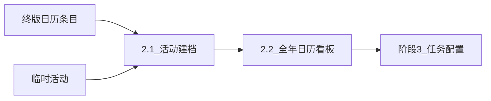
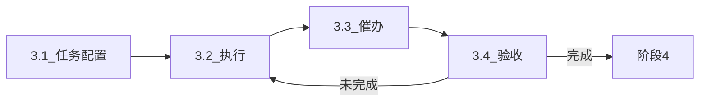
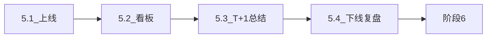
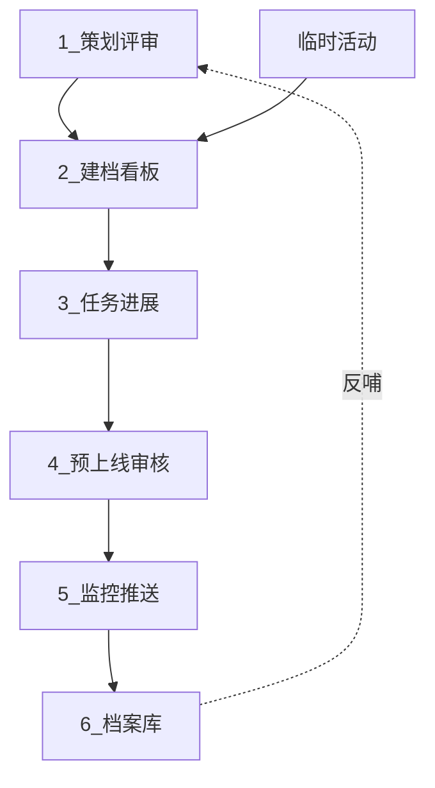

# 系统设计方案 v2 · 阶段 2–6（合并稿）

> **SOP 来源**：画板泳道（待你文字校正）  
> **状态**：draft · 2026-09-07

---

# 阶段 2：建档和任务创建

**系统模块**：方案策划 Agent（agent2）

## 摘要

| 维度 | 内容 |
|---|---|
| 干什么 | 终版日历条目 → 活动建档 → 档案模板补全 → 全年营销看板 |
| 负责人 | 营销（Jim）、AI 辅助补字段 |
| 输入 | 终版日历 adopted 条目、标准/创意/临时类型 |
| 输出 | activity_id、主档 Schema、看板可见活动 |
| 闸门 | 建档字段与评审字段一致性确认（Jim） |
| 下游 | 看板就绪 → 阶段 3 任务配置 |

| 功能 ID | 功能 | 状态 |
|---|---|---|
| activity_archive | 分类建档 | 骨架 |
| archive_template | 模板补全 | 占位 Jim |
| marketing_kanban | 手机日历+甘特 | 骨架 |

**待确认**：看板优先月视图还是甘特？30/60/90 天是否三档切换？

---

# 阶段 3：活动任务进展管理

**系统模块**：任务监督 Agent（agent3）

## 摘要

| 维度 | 内容 |
|---|---|
| 干什么 | 配置资源/素材/营销任务 → 三线执行 → 催办 → 验收 |
| 负责人 | 营销、资源（Rachel）、素材（梓淮） |
| 规则 | 创建**不通知**；催办时间**人配置** |
| 循环 | 未完成 → 回 3.2；完成 → 阶段 4 |

| 功能 ID | 功能 | 状态 |
|---|---|---|
| task_config | 三线模板 | 占位 Jim+Rachel |
| task_execution | 接受/执行 | 骨架 |
| task_reminder | 飞书催办 | 骨架 |
| task_acceptance | 验收回退 | 骨架 |

**待确认**：T 节点沿用 T-8/T-4/T-2/T-1 还是 Jim 新清单？

---

# 阶段 4：活动预上线审核

**系统模块**：上线审核 Agent（agent4）

## 摘要

| 维度 | 内容 |
|---|---|
| 干什么 | T-1 提醒 → 预上线 Checklist → 风险分级 |
| 负责人 | AI 提醒、营销审核 |
| 规则 | **T-1 非 T-7** |

| 功能 ID | 功能 | 状态 |
|---|---|---|
| launch_remind_t1 | T-1 提醒 | 骨架 |
| launch_checklist | Checklist | 占位 Jim |
| risk_grading | 低/中/高 | 骨架 |

---

# 阶段 5：上线监控与效果推送

**系统模块**：监控优化 Agent（agent5）+ 复盘入口（agent6 5.4）

## 摘要

| 维度 | 内容 |
|---|---|
| 干什么 | 上线 → 看板 → T+1 总结 → 下线复盘 |
| 负责人 | 营销、数据（曼薇） |
| 规则 | T+1 推送；GP = TTV×1–2% |

| 功能 ID | 功能 | 状态 |
|---|---|---|
| activity_go_live | 状态切换 | 骨架 |
| monitor_dashboard | 看板 | 占位 曼薇 |
| monitor_summary_t1 | 次日推送 | 骨架 |
| offline_review | 复盘 | 占位 Jim |

---

# 阶段 6：档案库管理

**系统模块**：复盘归档 Agent（agent6）

## 摘要

| 干什么 | 沉淀知识库 → Agent 问答 → 反哺阶段 1 |
| 输出 | 案例库、客户/酒店清单、标签规则 |

| 功能 ID | 功能 | 状态 |
|---|---|---|
| knowledge_deposit | 四库入库 | 骨架 |
| knowledge_qa | RAG 问答 | 骨架 |

---

# 六阶段总关系

