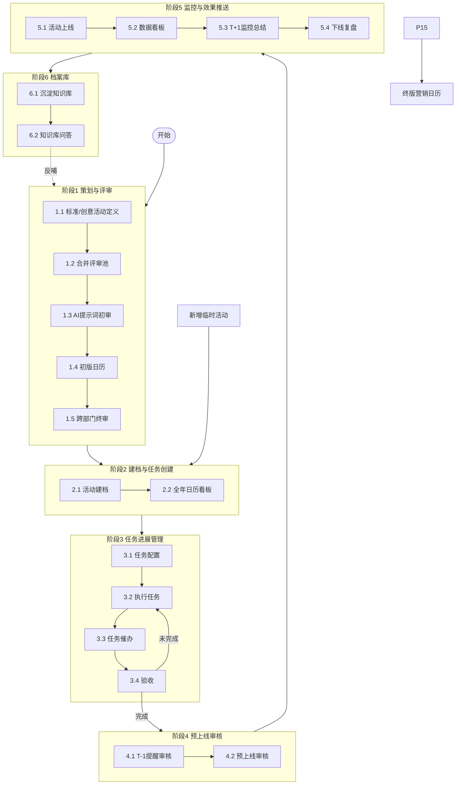
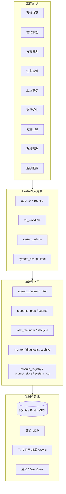
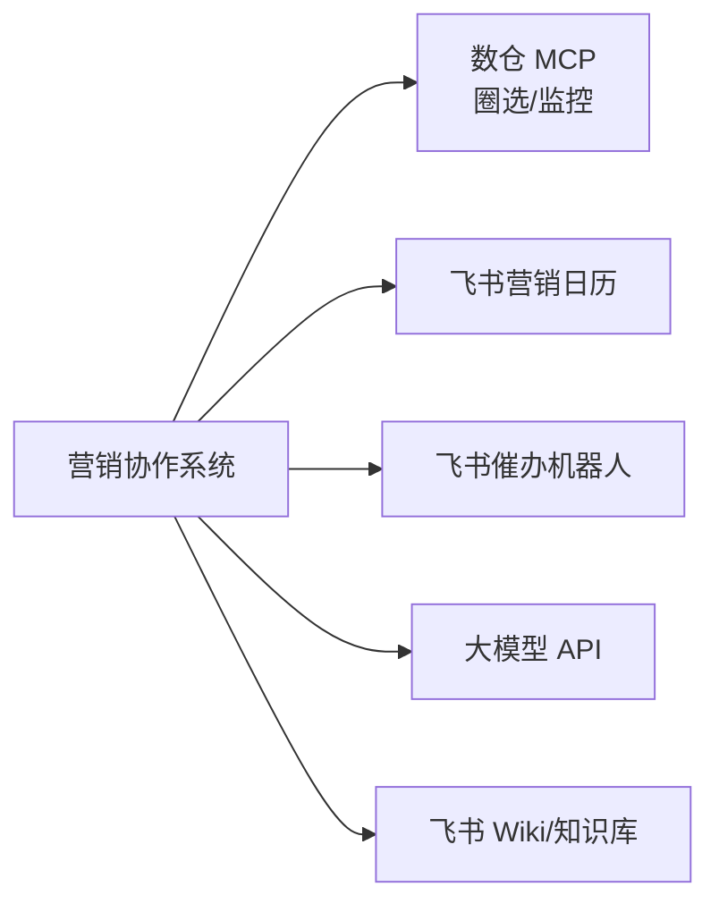

# 多 Agent 营销协作系统 · 系统开发方案 PRD

> **版本**：v1.0-draft · 评审稿  
> **日期**：2026-09-04  
> **用途**：下周技术/业务联合评审 — 确认系统流程、主要模块、模块功能、技术框架是否可行  
> **流程基线**：飞书 Wiki 画板泳道（六阶段） · [`SOP_V2_WHITEBOARD_FLOW.md`](SOP_V2_WHITEBOARD_FLOW.md)  
> **现状**：原型骨架已跑通部分路径；本 PRD 定框架，细节 I/O 待 Jim 等提供后迭代

---

## 1. 文档说明

### 1.1 评审要解决什么

| # | 评审议题 | 期望结论 |
|---|---|---|
| R1 | **系统流程**是否与线下画板 SOP 一致 | 确认 / 修改意见 |
| R2 | **主要模块**（6 Agent + 系统管理）划分是否合理 | 确认 / 合并或拆分 |
| R3 | 各模块**主要功能**是否覆盖业务需要 | 确认 / 增删功能点 |
| R4 | **技术架构**是否可支撑内网部署与后续扩展 | 确认 / 技术风险 |
| R5 | **整体框架**（骨架先行 + 占位配置）是否认可 | 确认后进入分期开发 |

### 1.2 本文不覆盖（评审后第二阶段）

- 各功能的详细输入/输出字段、判断阈值、审批流细则（**待 Jim / 永如 / 曼薇 / Rachel 提供**）
- 生产环境最终部署方案与 SLA（郑泽明 / 廖秋霞侧）
- 外部账号体系与权限隔离（画板便签待议）

### 1.3 相关文档索引

| 文档 | 内容 |
|---|---|
| [`SOP_V2_WHITEBOARD_FLOW.md`](SOP_V2_WHITEBOARD_FLOW.md) | 线下六阶段泳道流程 |
| [`SYSTEM_MODULE_SKELETON.md`](SYSTEM_MODULE_SKELETON.md) | 骨架建设策略与占位配置 |
| [`config/modules.yaml`](../config/modules.yaml) | 功能模块注册表（26 项） |
| [`TECH_REVIEW_CHECKLIST.md`](TECH_REVIEW_CHECKLIST.md) | 评审会议勾选清单 |

---

## 2. 背景与建设目标

### 2.1 业务背景

道旅 Shopping 营销活动从**全年策划 → 建档筹备 → 任务执行 → 上线审核 → 监控复盘 → 知识沉淀**全链路，目前依赖飞书文档、人工表格与分散沟通。目标是建设**营销协作系统**，作为管控中枢：

- 活动状态、待办、交付、验收可追溯  
- AI 辅助创意与圈选，**人工闸门**保留决策权  
- 与飞书日历、数仓 MCP、催办机器人集成  

### 2.2 建设目标（本阶段）

1. **流程数字化**：画板六阶段 → 系统六 Agent 工作台  
2. **模块可扩展**：每个功能留入口；业务细节后填不改架构  
3. **可评审可演示**：下周评审时展示流程图 + 模块表 + 原型入口  
4. **分期交付**：评审通过后按 P0→P1→P2 开发，不一次性做满  

### 2.3 核心原则（与 SOP 一致）

| 原则 | 说明 |
|---|---|
| 业务优先 | 规则来自人工 SOP，系统不反推业务 |
| 人机协同 | AI 采集/催办/统计；评审、改价、资源确认必须人工 |
| 只要 AI 池 | Wiki 明确：不需要单独「人工池」，人工规划与 AI 创意在同一评审池 |
| T-1 审核 | 上线审核锚点 T-1（非 T-7） |
| 催办规则 | 任务创建不通知；催办时间由人配置 |
| GP 估算 | 预订 GP = TTV × 1%–2% |

---

## 3. 线下流程基线（画板 · 六阶段）

**权威来源**：Wiki 内嵌画板 `OgJcwdUfQhIHffbLjzLcmDJ2n3c`（泳道主看板）。Wiki 表格仅阶段 1 有字，**2–6 以画板为准**。

### 3.1 阶段与角色

| 阶段 | 名称 | 子步骤 | 主要角色 |
|---|---|---|---|
| 1 | 营销活动策划和评审 | 1.1–1.5 | AI（军军、永如）、营销（Jim、博越） |
| 2 | 建档和任务创建 | 2.1–2.2 | 营销、AI |
| 3 | 活动任务进展管理 | 3.1–3.4 | 营销、资源（Rachel、侯老师）、素材（梓淮） |
| 4 | 活动预上线审核 | 4.1–4.2 | AI（T-1 提醒）、营销 |
| 5 | 上线监控与效果推送 | 5.1–5.4 | 营销、数据（楠姐、曼薇、秋霞） |
| 6 | 档案库管理 | 6.1–6.2 | 全员沉淀 + AI 问答反哺 |

### 3.2 端到端流程图



---

## 4. 系统总体架构

### 4.1 逻辑架构



### 4.2 六阶段 ↔ 六 Agent 映射

| 画板阶段 | 系统 Agent | 工作台入口 | 定位 |
|---|---|---|---|
| 1 策划与评审 | **营销策划 Agent** | 侧栏 Agent1 | 评审池、AI 创意、日历定稿 |
| 2 建档与任务创建 | **方案策划 Agent** | Agent2 | 建档、圈选分析、任务池生成 |
| 3 任务进展管理 | **任务监督 Agent** | Agent3 | 三线看板、催办、验收 |
| 4 预上线审核 | **上线审核 Agent** | Agent4 | T-1 Checklist、风险分级 |
| 5 监控与效果推送 | **监控优化 Agent** | Agent5 | 看板、T+1 总结、优化建议 |
| 6 档案库管理 | **复盘归档 Agent** | Agent6 | 复盘报告、四库、知识问答 |
| — | **系统管理** | 系统管理 | 模块总览、日志、占位配置 |

> **说明**：Agent 按**阶段主责**划分，任务监督 Agent 贯穿阶段 2–5 督办，与画板「3 任务进展管理」列对应。

---

## 5. 主要模块与功能清单

### 5.1 模块总览（26 功能点）

| 状态 | 数量 | 含义 |
|---|---|---|
| skeleton | 18 | 入口/骨架已有，逻辑待实现 |
| placeholder | 7 | 等业务填内容（提示词/模板/字段） |
| ready | 1 | 连接配置可跑通 |

### 5.2 阶段 1 · 营销策划 Agent

| 功能 ID | 功能名称 | 主要能力（评审确认） | 自动化边界 | 业务输入依赖 |
|---|---|---|---|---|
| standard_activity_fields | 标准活动字段 | 标准活动 Schema、表头字段 | AI 辅助生成草案 | Jim：字段定稿 |
| creative_activity_fields | 创意活动字段 | 创意活动扩展字段 | AI 读创意维度 | Jim：字段定稿 |
| ai_creative_prompt | AI 创意提示词 | 提示词配置入口、调用 LLM 生成创意 | 自动采集；**内容待填** | **永如**：提示词正文 |
| review_pool | 评审池 | 采纳/拒绝/修改；仅 AI 池 + 人工规划并入 | 列表展示 + 人工闸门 | 评审池 7 列字段 |
| calendar_finalize | 终版营销日历 | 定稿导出、同步飞书/本地 | 半自动 | Jim：终审规则 |
| manual_plan_sop | 人工规划 SOP | 占位存储 Jim 的规划方法论 | 未来 AI 学习用 | **Jim**：SOP 文档 |
| temp_activity_intake | 临时活动 | 非日历入口立项 | 人工创建 | Jim：字段是否与规划一致 |

### 5.3 阶段 2 · 方案策划 Agent

| 功能 ID | 功能名称 | 主要能力 | 自动化边界 | 业务输入依赖 |
|---|---|---|---|---|
| activity_archive | 活动建档 | activity_id、标准/创意/临时分类 | 一键建档 + 人工验收 | Jim：建档模板 |
| archive_template | 档案模板补全 | 十三模块 Schema、缺失字段提醒 | AI 补全建议 | **Jim**：archive_field_spec |
| marketing_kanban | 全年日历看板 | 手机日历式月视图；30/60/90 天甘特 | UI 为主 | Jim：看板交互确认 |

### 5.4 阶段 3 · 任务监督 Agent

| 功能 ID | 功能名称 | 主要能力 | 自动化边界 | 业务输入依赖 |
|---|---|---|---|---|
| task_config | 任务配置 | 资源/素材/营销三线任务模板 | 按模板批量创建 | **Jim+Rachel**：task_templates |
| task_execution | 任务执行 | 接受任务、更新状态、活动详情 | 人工执行为主 | — |
| task_reminder | 任务催办 | 飞书 Webhook；**创建不通知** | 定时催办；**人配时间** | Jim：催办规则 |
| task_acceptance | 任务验收 | 完成/驳回；未完成回退执行 | 人工闸门 | Jim |

**看板能力（横切）**：任务看板支持人工增删改（Wiki #6）。

### 5.5 阶段 4 · 上线审核 Agent

| 功能 ID | 功能名称 | 主要能力 | 自动化边界 | 业务输入依赖 |
|---|---|---|---|---|
| launch_remind_t1 | T-1 提醒审核 | 上线前 1 天自动提醒 | 系统通知 | — |
| launch_checklist | 预上线审核 | 结构化 Checklist、阻断项 | AI 预检 + 人工确认 | **Jim**：launch_checklist |
| risk_grading | 风险分级 | 低/中/高；中批高退 | 规则引擎（待填） | Jim：分级标准 |

### 5.6 阶段 5 · 监控优化 Agent

| 功能 ID | 功能名称 | 主要能力 | 自动化边界 | 业务输入依赖 |
|---|---|---|---|---|
| activity_go_live | 活动上线 | 状态切换为执行中 | 可对接定时上下线 | — |
| monitor_dashboard | 数据看板 | 曝光/CTR/CVR/GMV/GP 等 | 数仓 MCP 拉数 | **曼薇**：monitor_fields |
| monitor_summary_t1 | T+1 监控总结 | 上线次日摘要推送飞书 | 自动生成 + 推送 | 推送渠道确认 |
| offline_review | 下线复盘 | 复盘报告入口（5.4） | AI 草稿 + 人工结论 | **Jim**：review_template |

### 5.7 阶段 6 · 复盘归档 Agent

| 功能 ID | 功能名称 | 主要能力 | 自动化边界 | 业务输入依赖 |
|---|---|---|---|---|
| knowledge_deposit | 沉淀知识库 | 案例库、客户/酒店清单入库 | 归档写库 | 飞书知识库 + DB |
| knowledge_qa | 知识库问答 | RAG 问答反哺策划 | AI 问答 | 语料积累后启用 |

### 5.8 系统管理模块

| 功能 ID | 功能名称 | 主要能力 | 现状 |
|---|---|---|---|
| system_admin | 系统管理后台 | 模块总览、状态统计 | 已上线骨架 |
| system_logs | 运行日志 | 操作/启动/配置变更日志 | 已上线 |
| integration_config | 连接配置 | MCP、飞书、LLM、催办 Webhook | **ready** |

---

## 6. 技术方案

### 6.1 技术栈

| 层级 | 选型 | 说明 |
|---|---|---|
| 后端 | **Python 3.11 + FastAPI** | REST API、APScheduler 定时催办 |
| 前端 | **原生 HTML/JS 工作台** | 内网单页；后续可换 React |
| 数据库 | **SQLite（开发）/ PostgreSQL（生产）** | 活动主档、任务、日志、归档 |
| 配置 | **YAML** | agents.yaml、modules.yaml、prompts/ |
| AI | **通义 / DeepSeek**（可配置） | 创意生成、诊断、复盘草稿 |
| 数仓 | **Warehouse MCP** | 圈客选品、监控指标 |
| 协作 | **飞书** | 营销日历 Bitable、催办 Webhook、Wiki 同步 |
| 运维 | **system_logs 表 + 系统管理 UI** | 后续接 ELK 可选 |

### 6.2 部署形态（评审确认）

| 环境 | 形态 | 负责人（建议） |
|---|---|---|
| 开发/演示 | 本地 `py -3.11 -m app.main` + SQLite | 研发团队 |
| 内网测试 | 单节点 uvicorn + PostgreSQL | 郑泽明 |
| 生产 | 内网服务器 + PG + 定时 ETL | 廖秋霞 / 郑泽明 |

### 6.3 关键集成



| 集成 | 用途 | 现状 |
|---|---|---|
| 数仓 MCP | Agent2 圈选、Agent5 监控 | Mock / 可切 Live |
| 飞书日历 | Agent1 日历输入 | Mock / Bitable |
| 飞书 Webhook | Agent3 催办 | 可配置 |
| LLM | 创意、诊断、总结 | 需配 API Key |
| lark-cli | Wiki/SOP 同步、运维 | 已安装授权 |

### 6.4 数据模型（核心实体）

| 实体 | 说明 | 主要表/模型 |
|---|---|---|
| 活动主档 | activity_id、类型、Schema v3 | dim_campaign、plan_structured_json |
| 生命周期 | proposal → adopted → prep → live → archived | lifecycle_service |
| 任务池 | 资源/方案/素材三线 | fact_activity_todos |
| 评审池 | AI 建议 pending | intel_service |
| 归档/案例 | 复盘、四库 | dim_activity_archive |
| 系统日志 | 运维审计 | system_logs |
| 占位配置 | 提示词/模板 | config/prompts/*.yaml |

---

## 7. 建设策略：骨架先行 + 占位配置

### 7.1 为什么这样拆

- 画板流程已清晰，但 **Jim 侧细节**（任务清单、审核维度、复盘模板）尚未齐  
- 先固定**流程 / 模块 / 入口**，避免等业务细节耽误架构评审  
- 业务内容通过 **系统管理 → 占位配置** 填入，无需改代码发版（首版）

### 7.2 三层对应关系

```
画板 SOP（六阶段）
    → 6 Agent 工作台（UI）
        → 26 功能模块（modules.yaml）
            → 7 份占位配置（prompts/，待业务填）
```

---

## 8. 分期开发计划（评审通过后）

### 8.1 里程碑

| 阶段 | 时间（建议） | 目标 | 交付 |
|---|---|---|---|
| **M0 评审** | 下周 | 流程/模块/技术框架确认 | 本 PRD 签字 |
| **M1 主路径** | +2 周 | P0：评审池、建档、T-1、催办规则 | 可演示一条活动走通 1→4 |
| **M2 任务闭环** | +2 周 | P1：看板 CRUD、Checklist 结构化、监控字段 | 3→5 可演示 |
| **M3 智能化** | +3 周 | P2：T+1 推送、知识库问答、日历 UX | 6 反哺 1 |
| **M4 生产** | 待定 | PG 部署、权限、备份 | 郑泽明侧 |

### 8.2 P0 优先级（评审通过后第一批）

1. 标准/创意活动类型 Schema  
2. 评审池字段与采纳/拒绝  
3. 建档状态机 proposal → adopted  
4. T-1 审核锚点统一  
5. 任务创建不通知 + 人工配置催办时间  
6. 占位配置接入各 Agent 读取  

---

## 9. 业务依赖与待确认项

### 9.1 占位配置（评审前尽量收集）

| 配置 | 负责人 | 评审是否带来 |
|---|---|---|
| AI 创意提示词 | 永如 | ☐ |
| 人工规划 SOP | Jim | ☐ |
| 任务模板（T 节点/催办） | Jim + Rachel | ☐ |
| 预上线审核 Checklist | Jim | ☐ |
| 监控字段 | 曼薇 | ☐ |
| 复盘模板 | Jim | ☐ |
| 建档 vs 评审字段对照 | Jim | ☐ |

### 9.2 流程级待决（评审会议讨论）

| # | 问题 | 建议草案 |
|---|---|---|
| Q1 | 六阶段画板是否为最终 SOP | 是（Wiki 表格 2–6 空） |
| Q2 | 是否只要 AI 池 | 是（Wiki 正文） |
| Q3 | 外部用户是否要账号体系 | 画板便签 · 评审议 |
| Q4 | T-1 突发不足 1 天怎么办 | Jim 便签 · 保留人工加急 |
| Q5 | 日历 UX：月视图 vs 甘特优先级 | 两者都要 · 分期做 |

---

## 10. 评审会议建议议程（60–90 分钟）

| 时间 | 议题 | 产出 |
|---|---|---|
| 10 min | 画板六阶段流程走读 | 流程确认 / 修改点 |
| 15 min | 六 Agent + 系统管理模块介绍 | 模块划分确认 |
| 20 min | 各模块主要功能 + 自动化边界 | 功能增删清单 |
| 10 min | 技术架构与集成 | 技术风险与部署共识 |
| 10 min | 占位配置与 Jim 依赖 | 业务交付时间表 |
| 10 min | P0 范围与里程碑 | 签字 / 待办 |

**演示建议**：打开工作台 → 系统管理（模块总览）→ 各 Agent 入口 → 占位配置页。

---

## 11. 评审签字

| 角色 | 姓名 | 流程 | 模块 | 功能 | 技术 | 日期 |
|---|---|:---:|:---:|:---:|:---:|---|
| 产品/营销 | Jim | ☐ | ☐ | ☐ | ☐ | |
| AI | 军军 / 永如 | ☐ | ☐ | ☐ | ☐ | |
| 数据 | 曼薇 / 秋霞 | ☐ | ☐ | ☐ | ☐ | |
| 资源 | Rachel | ☐ | ☐ | ☐ | ☐ | |
| 研发 | | ☐ | ☐ | ☐ | ☐ | |
| 运维/部署 | 郑泽明 | ☐ | — | — | ☐ | |

**确认开发启动条件**：上表「流程 + 模块 + 功能 + 技术」四项中，产品侧与研发侧无阻塞性反对意见，P0 范围书面确认。

---

## 12. 附录 A · 模块—API—代码路径对照

| Agent | 主要代码路径 |
|---|---|
| 营销策划 | `app/services/v2/agent1_planner.py`、`intel_service.py` |
| 方案策划 | `app/services/v2/agent2_resource.py`、`resource_prep_analysis.py` |
| 任务监督 | `app/services/v2/task_reminder.py`、`lifecycle_service.py` |
| 上线审核 | `app/routers/agent4.py`、`app/services/agent4_service.py` |
| 监控优化 | `app/services/v2/agent3_monitor.py`、`campaign_diagnosis.py` |
| 复盘归档 | `app/services/v2/agent5_archive.py` |
| 系统管理 | `app/routers/system_admin.py`、`module_registry.py` |
| 工作台 UI | `ui/dashboard/app.js` |

---

## 13. 附录 B · 版本记录

| 版本 | 日期 | 说明 |
|---|---|---|
| v1.0-draft | 2026-09-04 | 基于画板六阶段 + 模块骨架首稿，供下周评审 |
