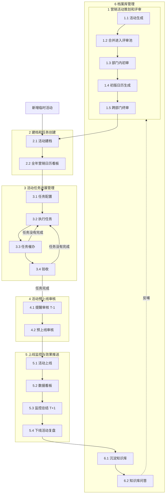

# Wiki 全文读取结果 · 营销协作系统流程问题档案

> 来源：https://didatravel.feishu.cn/wiki/MLwxwT1nViDDvpk94YlcVVD8n4d  
> 读取时间：2026-09-04 · 工具：lark-cli docs +fetch + whiteboard +export

---

## 读取完整度评估

| 区块 | 状态 | 说明 |
|---|---|---|
| 表格 · 阶段 1（1.1–1.5） | ✅ 完整 | 标准/创意活动定义、字段、评审子流程 |
| 表格 · 阶段 2–7 | ❌ 空行 | Wiki 表格 9 行空白，**无表格文字** |
| 页脚「确认和参考」 | ✅ 完整 | 标准/创意字段复述 |
| 问题清单 4–13 | ✅ 完整 | 存库、日历 UX、催办、T-1、监控、复盘等 |
| 画板 1（BftawFL…） | ✅ 大部分 | 53 个节点文本；连线方向需人工对照 |
| 画板 2（OgJcwdU…） | ✅ 大部分 | 107 个节点文本；**六阶段泳道 + 角色分工** |
| 画板评论（潘永如） | ⚠️ 部分 | 文本引用在 fetch 中；评论内图片未 OCR |
| 内嵌图片（T-7 截图） | ⚠️ 仅 alt | 知道与「T-1 非 T-7」相关 |
| 便签 / Jim 待办 | ✅ 可读 | 在画板 2 raw JSON 中 |

**结论**：表格只写了阶段 1；**整体流程以画板泳道为准（最新）**，见 `docs/SOP_V2_WHITEBOARD_FLOW.md`。  
**画板 2**（`OgJcwdU…`）= 下方泳道主看板；**画板 1**（`BftawFL…`）= 上方简图，与泳道一致。

---

## 六阶段总流程（来自画板 2 泳道）

---

## 角色分工（画板 2）

| 角色 | 人员 | 主责阶段 |
|---|---|---|
| **AI** | 军军、永如 | 阶段 1 创意池、提示词、日历 AI 输出 |
| **营销** | Jim、博越 | 评审、建档、任务配置、审核 |
| **数据** | 楠姐、曼薇、秋霞 | 监控字段、看板、数据入库 |
| **资源** | Rachel、侯老师 | 资源任务接受与执行 |
| **素材** | 梓淮 | 素材任务接受与执行 |

画板 1 另有泳道：**AI / 营销 / 跨部门 / 资源 / 数据**，与「配置资源和营销的任务」「资源接受任务」「营销接受任务」等节点对应。

---

## 阶段 1 明细（表格 + 画板一致）

| 子流程 | 任务要点 | 交付/字段 |
|---|---|---|
| 1.1 | 定义标准活动 + 表头 | 国庆/五一/春节/泼水节/端午/暑寒等；标准字段集 |
| 1.2 | 定义创意活动 + 表头 + 主题类型数 | 亲子/美食/滑雪/樱花等；创意扩展字段集 |
| 1.3 | AI 创意提示词 | 名称、上线时间、城市、类型、客群、酒店画像 |
| 1.4 | 人工 2027 初版；是否评审、评审人 | 初版日历 |
| 1.5 | 日历字段 = 点进活动文档字段 | 跨部门终审 |

**评审池日历列（评论 c5）**：月份、活动名称、活动来源（经验规划/AI创意）、活动类型、活动月份、活动目的地、评审入口（采纳/拒绝）

---

## 阶段 2–6 明细（仅画板，Wiki 表格为空）

### 2 建档和任务创建
- **2.1 活动建档**：按标准/创意/临时活动分类；生成档案模板、补全缺失字段；Jim 确认建档字段与评审字段是否一致
- **2.2 全年营销日历看板**：类似手机日历；未来 30/60/90 天任务进展（甘特）；人工增删查改入口

### 3 活动任务进展管理
- **3.1 任务配置**：配置资源、素材、营销三类任务（名称、类型、T 节点、催办次数 — Jim/Rachel 待输出清单）
- **3.2 执行任务**：资源/素材/营销分别「接受任务 → 执行」
- **3.3 任务催办**：创建**不通知**；人配置发送时间；AI 只创建任务
- **3.4 验收**：未完成 → 回 3.2；完成 → 进入阶段 4

### 4 活动预上线审核
- **4.1 提醒审核**：**T-1**（非 T-7）；Jim 担心突发情况 1 天是否够
- **4.2 预上线审核**：Jim 输出审核维度与标准（含图片参考）

### 5 上线监控与效果推送
- **5.1 活动上线**
- **5.2 数据看板**：曼薇提供监控字段（标准型/创意型分列）
- **5.3 监控总结**：**T+1 推送**
- **5.4 下线活动复盘**：Jim 提供复盘模板（⑦ 段结构 + 产出物清单）

### 6 档案库管理
- **6.1 沉淀知识库**：飞书知识库 + 数据入库（MCP 接表）
- **6.2 知识库问答**：Agent 问答助手，反哺阶段 1

---

## Wiki 问题清单（正文编号，与画板呼应）

1. AI 提示词加 B2B；**不需要人工池，只要 AI 池**
2. 梳理人工线下规划流程 @Jim
3. 评审环节加泳道图
4. **数据存数据库**，信息留存（廖秋霞、郑泽明）
5. **日历像手机日历**
6. 催办：标记完成；看板**人工增删**
7. 催几次、交付要不要催 — **待 Jim 定规则**
8. 创建任务**不发通知**；**人配发送时间**
9. 审核 **T-1 非 T-7**
10. 监控字段维度（刘曼薇）
11. 上线**次日**监控总结推送
12. 复盘闭环 + Agent 知识库问答
13. 2027 人工规划逻辑/维度/数据（郭毅勋）

---

## 尚未读全 / 待补充

1. **画板连线顺序**：节点文本齐全，但自动还原精确 DAG 需对照飞书 UI 或导出 preview 图  
2. **Wiki 表格 2–7 行**：飞书内为空，是否与画板故意分工（表格写 1、画板写 2–6）待你确认  
3. **评论内截图**（潘永如 4 条）：未 OCR  
4. **Jim 待输出项**：任务清单（T 节点/催办次数）、审核维度表、复盘模板定稿、人工规划 SOP

---

## 本地缓存文件

- `docs/feishu_import/whiteboard1-raw.json`
- `docs/feishu_import/whiteboard2-raw.json`
- `docs/feishu_import/whiteboard-texts.md`
